# Introduzione

## Il concetto di Linguaggio

Un **Linguaggio di Programmazione** è uno **Strumento** che ci permette di **descrivere in maniera rigorosa problemi**, in modo tale che questi possano poi essere **risolti da un esecutore automatico**.

### Lessico VS Sintassi

Il **Lessico** è l'**insieme delle Parole e delle Locuzioni** di una lingua (***Tokenizzazione***), mentre la **Sintassi** è la parte della **Grammatica** che studia come queste parole si combinano per formare **Frasi** e **Periodi**.

### Compilatore e Linguaggi

Il **Compilatore** è un **Parser** che permette la **generazione di Codice Oggetto**

La **Generazione Automatica del Codice** del compilatore per un nuovo linguaggio richiede un **Approccio Dichiarativo**, la **Logica della Computazione** viene espressa **senza descrivere il suo controllo di flusso**.

## Automi a Stati Finiti

Un **Automi a Stati Finiti** è un **Modello** per descrivere **Situazioni di Calcolo** in cui si consumano informazioni una alla volta, e durante la consumazione si devono memorizzare quantità finite di informazioni.

Esempio: automa a stati finiti per un interruttore on/off

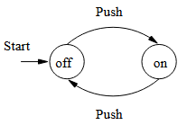

## Macchina di Turing

La ***Macchina di Turing*** è un **Modello Matematico** di un semplice **Esecutore Automatico** o **CPU** (Automa con Memoria Ausiliaria).

La ***Tesi di Turing-Church*** afferma che:

*Ogni **Problema** calcolabile da un **Algorimo**, o meglio tramite una **Procedura**, può essere risolto da una **Macchina di Turing***.

### Procedura VS Algoritmo

Una **Procedura** (AKA Pseudocodice) differisce da un **Algoritmo** poiché **non garantiscano la Terminazione**.

## Modelli Computazionali

I **Modelli Computazionali** sono **rappresentazioni** di **Sitemi DIstribuiti** o **Concorrenti**.

### Logiche Temporali

Le **Logiche Temporali**, permettono di esprimere le varie **Proprietà** del **Modello**.

I **Model Checker** sono **Strumenti** che **verificano** se delle **Proprietà** espresse tramite delle **Logiche Temporali** valgano oppure no.

---

# Linguaggi Regolari, DFA e NFA

## Concetti di Base

- **Alfabeto**: Insieme Finito e non vuoto di Simboli
- **Stringa**: Sequenza Finita di Simboli da un Alfabeto
- **Stringa Vuota** o $\epsilon$: La Stringa con Zero Occorrenze di Simboli
- **Lunghezza di una Stringa**: Numero di Posizioni per i Simboli nella Stringa. $$|0110| = 4$$
- **Potenze di un alfabeto**: Insieme delle Stringhe di Lunghezza $k$ con Simboli da $Σ$ $$|Σ|^k$$
- **Stella di Kleene** = Unitoria di tutte le Stringhe. $$\bigcup_{k\ge 0} \Sigma^k$$
- **Concatenazione**: Se x e y sono Stringhe, allora xy è la Stringa ottenuta concatenando una copia di y subito dopo una copia di x.

## Linguaggi

Dato un **Alfabeto** $Σ$, e $L ⊆ Σ^∗$ allora $L$ è un **Linguaggio**.

### Linguaggio Regolare

Un **Linguaggio Regolare** è un **Linguaggio Formale**, ossia costituito da un **Insieme di Stringhe** costruite con un **Alfabeto Finito**, che è descritto da un'**Espressione Regolare**, generato da una **Grammatica Generativa Regolare** o accettato da un **FSA**.

## Automi a Stati Finiti Deterministici

Un **DFA** è una **quintupla**:

$$A = (Q, Σ, δ, q0, F )$$

- $Q$ = Un **Insieme Finito** di **Stati**
- $Σ$ = Un **Alfabeto Finito**
- $δ$ = Una **Funzione di Transizione** da $Q × Σ \rightarrow Q$
- $q_0 ∈ Q$ = Lo **Stato Iniziale**
- $F ⊆ Q$ = Un **Insieme di Stati Finali**

Sono **Deterministici** poichè ogni **Transizione** è **unica** da **Stato** a **Stato**, non esiste casualità.

### Tabella e Diagramma di Transizione

Una **Tabella di Transizione** rappresenta i vari **Passaggi di Stato** che avvengono all'interno dell'**Automa**.

Un **Diagramma di Transizione** è una rappresentazinoe grafica di tutti i possibili **Passaggi di stato**.

### Funzioni di Transizione

La **Funzione di Transizione** $δ$ è la funzione che fornita una **Stringa** ritorna lo **Stato Finale dell'Automa**.

### Funzione di Transizione Estesa

La **Funzione di Transizione** $δ$ può essere estesa a $\hat{δ}$ che opera su **Stati** e **Stringhe**, invece che su **Stati** e **Simboli**.

$$\hat{\delta}(q,\epsilon)=q$$

da cui per induzione si ottine che:

$$\hat{\delta}(q,xa)=\delta(\hat{\delta}(q,x),a)$$

## Automi a Strati Nondeterministici (NFA)

Un **NFA** accetta una **Stringa** se esiste un **Cammino** che conduce ad uno **Stato Finale**.

Formalmente, un NFA è una quintupla:

$$A = (Q, Σ, δ, q_0, F )$$

- $Q$ = Un Insieme Finito di Stati
- $Σ$ = Un Alfabeto Finito
- $δ$ = Una Funzione di Transizione dall'Insieme $Q×Σ$ all’Insieme dei Sottoinsiemi di $Q$, ovvero $\delta(q, a) \rightarrow Q'$ con $Q' ⊆ Q$
- $q_0 ∈ Q$ è lo Stato Iniziale
- $F⊆Q$ = Un Insieme di Stati Finali

### Funzione di Transizione Estesa per NFA

A differenza dei **DFA**, negli **NFA** non parliamo più di **singoli Stati**, ma di **Insiemi di Stati**.

Quindi per induzione otteniamo:

$$\hat{\delta}(q,xa) = \bigcup_{p\in\hat{\delta}(q,x)}\delta(p,a)$$

E dunque il Linguaggio Accettato da un NFA è:

$$L(A)=\{w:\hat{\delta}(q_o,w)\cap F\not=\empty\}$$

### Equivalenza tra DFA e NFA

Per ogni **NFA** $N$ esiste un **DFA** $D$, tale per cui:

$$L(D)=L(N)$$

Questo comporta una **Costruzione a Sottoinsiemi**.

$$Q_D = \{S:S\subseteq Q_n\}$$

Dove:

$$|Q_D| = 2^{|Q_N|}$$

e

$$F_D = \{S\subseteq Q_N : S\cap F_N \not= \empty\}$$

quindi, per ogni $S\subseteq Q_N$ e $a\in \Sigma$ :

$$\delta_D(S,a) = \bigcup_{p\in S}\delta_N(p,a)$$

Possiamo inoltre evitare la **Crescita Esponenziale** degli **Stati** costruendo la **Tabella di Transizione** solo per **Stati Accessibili**.

### Teoremi

Sia $D$ il **DFA** ottenuto da un **NFA** $N$ con la **Costruzione a Sottoinsiemi**, allora:

$$L(D) = L(N)$$

Un **Linguaggio** $L$ è **accettato** da un **DFA** se e solo se $L$ è **accettato** da un **NFA**.

Il **Numero di Stati** del **DFA** equivalente ad un **NFA** con $n$ stati è, nel caso peggiore, pari a $2^n$ stati.

## Transizioni Epsilon

Una **Transizione Epsilon** consente a un **Automa** di **cambiare stato spontaneamente**, ovvero **senza consumare un simbolo di input**.

## ϵ-NFA

Un **ϵ-NFA** è una quintupla $(Q, Σ, δ, q_0, F)$ dove $δ$ è una **Funzione** da $Q×(Σ∪\{ϵ\})$ all’**Insieme dei Sottoinsiemi** di $Q$.

### Rappresentare un ϵ-NFA con Numeri Decimali

Un **ϵ-NFA** che accetta **Numeri Decimali** consiste di:

1. Un segno + o -, opzionale
2. Una stringa di cifre decimali
3. Un punto decimale
4. Un’altra stringa di cifre decimali

Una delle stringhe (2) o (4) è opzionale.

### Epsilon-chiusura

Chiudiamo uno **Stato** aggiungendo tutti gli **Stati raggiungibili** da lui tramite una sequenza $ϵ$.

$$q\in ENCLOSE(q)$$

Da cui, dato un $p$ per cui:

$$p\in ENCLOSE(q)$$

allora:

$$r\in\delta(p,\epsilon)\rightarrow r\in ENCLOSE(q)$$

Se $r$ è **raggingibile** da $p$ con **input** $\epsilon$, allora $r$ **appartiene** alla ENCLOSE di $q$

### Definizione di $\hatδ$ per ϵ-NFA

Partendo da:

$$\hat{\delta}(q,\epsilon)=ENCLOSE(q)$$

Otteniamo che:

$$\hat{\delta}(q,xa)=\bigcup_{p\in\hat{\delta(q,x)}}\bigg(\bigcup_{t\in\hat{\delta(p,a)}}ENCLOSE(t)\bigg)$$

Ma il **Linguaggio accettato** $L$ rimane definito come:

$$\{w:\hat{δ}(q_0, w)∩F\not=\empty\}$$

### Teroma

Un **Linguaggio** $L$ è accettato da un ***ϵ-NFA*** $E$ se e solo se $L$ è accettato da un $DFA$.

---

# Espressioni regolari

Un **FA** (**NFA** o **DFA**) è un metodo per costruire una macchina che riconosce **Linguaggi Regolari**.

Una **Espressione Regolare** è un **modo dichiarativo** per descrivere un **linguaggio regolare** (Ad esempio: $01^∗ + 10^∗$).

Ordine di precedenza:
- **Chiusura di Kleene**: $$L^*=\bigcup_{i\ge 0}L^i$$
- **Potenze**: $$L^0={\epsilon},\ L^1=L,\ L^{k+1}=L.L^k$$
- **Concatenazioni**: $$L.M = \{w : w=xy, x∈L,y ∈ M \}$$
- **Unione**: $$L∪M=\{w: w∈L\ ||\ w∈M \}$$

## Leggi Algebriche per i Linguaggi

L’**Unione** è **Commutativa** e **Associativa**, mentre la **Concatenazione** è **Associativa** e non commutativa.

$∅$ è l’**Identità** per l’**unione** e l’**Annichilatore Sinistro e Destro** per la **Concatenazione**.

${ϵ}$ è l’**Identità Sinistra e Destra** per la **Concatenazione**.

La **Concatenazione** è **Distributiva** a **Sinistra** e a **Destra** sull’**Unione**.

L’**Unione** è **Idempotente**.

## Costruire le Espressioni Regolari

### Definizione Induttiva di Espressioni Regolari:

- **Base**:
  - $ϵ$ e $∅$ sono **Espressioni Regolari**. $$L(ϵ)={ϵ}\quad L(∅)=∅$$.
  - Se $a ∈ Σ$, allora $a$ è un’**Espressioni Regolari**. $$L(a) = {a}$$

- **Induzione**:
  - Se $E$ è un’**Espressioni RegolarE**, allora $(E)$ è un’**Espressioni Regolari**. $$L((E)) = L(E)$$
  - Se $E$ e $F$ sono **Espressioni Regolari**, allora $E+F$ è un’**Espressioni Regolare**. $$L(E+F)=L(E)∪L(F)$$
  - Se $E$ e $F$ sono **Espressioni Regolari**, allora $E.F$ è un’**Espressioni Regolare**. $$L(E.F)=L(E).L(F)$$
  - Se $E$ è un’**Espressioni Regolare**, allora $E^⋆$ è un’**Espressioni Regolare**. $$L(E^⋆)=(L(E))^∗$$

## Equivalenza di FA e Espressioni Regolari

Per mostrare che gli **FA** sono equivalenti alle **Espressioni Regolari** dobbiamo stabilire che :
1. Per ogni **DFA** $A$ possiamo trovare (costruire, in questo caso) un’**Espressione Regolare** $R$, tale che $L(R)=L(A)$.
2. Per ogni **Espressione Regolare** $R$ esiste un **ϵ-NFA** $A$, tale che
$L(A)=L(R)$.

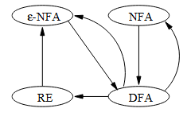

### Algoritmo ad Eliminazine degli Stati

Per ogni **DFA** $A=(Q, Σ, δ, q_0, F)$ esiste una **Espressione regolare** $R$, tale che $L(R)=L(A)$.

Trasformiamo ogni **Stato** in un'**Espressione Regolare**.

Nella scelta dei predecessori e successori non si considerano gli autocicli.

### Da Espressioni Regolari a ϵ-NFA

Per ogni **Espressione Regolare** $R$ possiamo costruire un **ϵ-NFA** $A$ (con un unico stato finale, diverso da quello iniziale), tale che $L(A) = L(R)$.

#### Dimostrazione per Induzione Strutturale:

Automa per ϵ, ∅, e a.

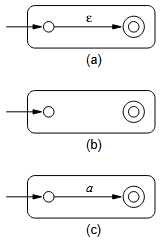

Automa per $R+S$, $RS$, e $R^∗$

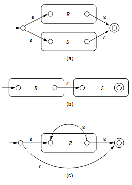

Ogni **Automa** può essere ridotto ad una **composizine** dei precedenti.

## Proprietà dei Linguaggi Regolari

- ***Pumping Lemma***:
  - Dato un **Linguaggio**, se usando **Pumping Lemma** si ottiene una **contraddizione** allora esso **non è Regolare**.
  - Ogni **Linguaggio Regolare** soddisfa il ***Pumping Lemma***.
- **Proprietà di Chiusura**:
  - Come costruire **Automi** da **Componenti** usando delle **Operazioni** e per quali operazioni è possibile farlo.
- **Proprieta di Decisione**:
  - **Analisi Computazionale di Automi**, ad esempio quando due automi sono equivalenti.
- **Tecniche di Minimizzazione**:
  - Possiamo risparmiare costruendo **Automi più piccoli**.

## Il Pumping Lemma
Supponiamo, per assurdo, che $L=\{0^h1^h : h≥0\}$ sia **regolare**, allora deve essere **accettato** da un qualche **DFA** $A$.

Chiamo $n$ il **Numero degli Stati** di $A$, se $A$ riceve in **input una stringa di lughezza $≥ n$** allora lungo il **Cammino di Riconoscimento** incontra **due volte uno stesso Stato**.

Il **Pumping Lemma** è basato su questa idea del **Ciclo** e vale per qualsiasi **Linguaggio Regolare**, in particolare sulla seguente proprietà di pompaggio dei linguaggi riconosciuti da **DFA**.

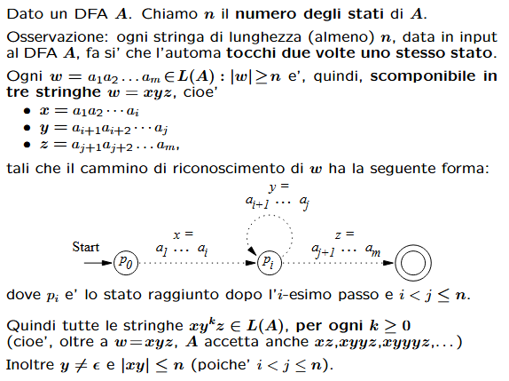

### Teorema

Sia $L$ un **Linguaggio Regolare**, allora $∃ n≥1$ che soddisfa:

$\forall w ∈ L:|w|≥n$ è scomponibile in **tre stringhe** $w = xyz$ tali che:
- $y \not= ϵ$
- $|xy| ≤ n$
- $∀k ≥ 0, xy^kz ∈ L$

### Dimostrazione

Supponiamo che $L$ sia **Regolare**, allora $L$ è riconosciuto da un **DFA** $A$.

Chiamo $n$ il **Numero degli Stati** di $A$, sia $w = a_1a_2\dots a_m ∈ L$ con $m ≥ n$, e sia $p_i = \hat{δ}(q_0, a_1a_2\dots a_i)$, dove $q_0$ è lo **Stato Inziale** di $A$.

$$∃ i < j ≤ n: p_i = p$$

Ora $w = xyz$, dove:
- $x = a_1a_2\dots a_i$
- $y = a_{i+1}a_{i+2}\dots a_j$
- $z = a_{j+1}a{j+2}\dots a_m$

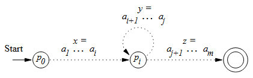

Quindi anche $xy^kz ∈ L$, per ogni $k ≥ 0$, inoltre $y \not= ϵ$ e $|xy| ≤ n$ poiché $i < j ≤ n$.

## Proprietà di Chiusura dei Linguaggi Regolari

Sono quelle **Operazioni** che **dati due Linguaggi Regolari** mi ritornano un **Linguaggio Regolare**.

I seguenti **Linguaggi** sono **Regolari**:
- **Unione**: $L ∪ M$
- **Intersezione**: $L ∩ M$
- **Complemento**: $\overline{N}$
- **Differenza**: $L \backslash M$
- **Inversione**: $L^R = \{w^R : w ∈ L\}$
- **Chiusura**: $L^∗$
- **Concatenazione**: $L.M$

### Unione

Per ogni coppia di **Linguaggi Regolari** $L$ e $M$ , $L ∪ M$ è $regolare$.

Sia $L = L(E)$ e $M = L(F)$, alora $L(E + F) = L ∪ M$ per definizione.

### Complemento

Se $L$ è un **Linguaggio Regolare** su $Σ$, allora anche $\overline{L} = Σ^∗\backslash L$ è **Regolare**.

Sia $L$ riconosciuto da un **DFA** $A = (Q, Σ, δ, q_0, F )$ e sia $B = (Q, Σ, δ, q_0, Q \ F )$, allora $L(B) = \overline{L}$

### Intersezione (Legge di DeMorgan)

Se $L$ e $M$ sono **Regolari**, allora anche $L ∩ M$ è **Regolare**.

Per la **Legge di DeMorgan**, $L ∩ M = \overline{\overline{L} ∪ \overline{M}}$, sappiamo già che i **Linguaggi Regolari** sono **chiusi rispetto al Complemento e all’Unione**.

#### Prova alternativa.

Sia $L$ il **Linguaggio** di $A_L = (Q_L, Σ, δ_L, q_L, F_L)$ e $M$ il **Linguaggio** di $A_M = (Q_M , Σ, δ_M , q_M , F_M )$

Assumiamo senza perdita di generalità che entrambi gli **Automi siano Deterministici**, costruiremo un **Automa** che simula $A_L$ e $A_M$ in **parallelo**, e **accetta se e solo se sia $A_L$ che $A_M$ accettano**.

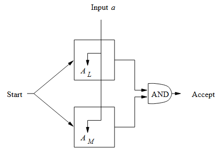

Formalmente:

$$A_{L∩M} = (Q_L × Q_M , Σ, δ_{L∩M} , (q_L, q_M), F_L × F_M)$$

dove:

$$δ_{L∩M}((p, q), a) = (δ_L(p, a), δ_M(q, a))$$

Si può mostrare per induzione su $|w|$ che:

$$\hat{δ}_{L∩M}((q_L, q_M ), w) = (\hat{δ}_L(q_L, w), \hat{δ}_M (qM , w))$$

#### Costruzione per Simulazione Parallela

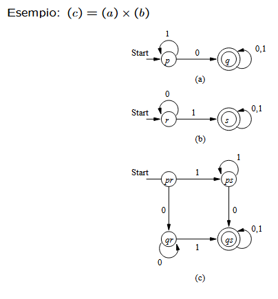

### Differenza

Se $L$ e $M$ sono **Linguaggi Regolari**, $L \backslash M$ è $regolare$.

Osserviamo che $L \backslash M = L ∩ \overline{M}$, sappiamo già che i **Linguaggi Regolari** sono **chiusi rispetto al Complemento e all’Intersezione**.

### Reverse

Se $L$ è un **Linguaggio Regolare**, allora anche $L^R$ (Le **Stringhe** $w^R$, cioé $w$ lette al contrario, con $w ∈ L$) è **Regolare**.

Sia $L$ riconosciuto da un **FA** $A$, modifichiamo $A$ per renderlo un **FA** per $L^R$:
1. Giriamo tutti gli archi.
2. Rendiamo il vecchio stato iniziale l’unico stato finale.
3. Creiamo un nuovo stato iniziale $p_0$, con $δ(p_0, ϵ) = F$ (I vecchi stati finali).

## Proprietà di Decisione

- è L = ∅?
- è w ∈ L?
- Due descrizioni definiscono lo stesso linguaggio?

### Testare se un Linguaggio è Vuoto

$L(A)\not= ∅$ per **FA** $A$ se e solo se uno **Stato Finale** è **raggiungibile dallo Stato Iniziale in $A$**. (Totale: $O(n^2)$ passi)

Oppure, possiamo guardare un’**Espressione Regolare** $E$ di **Lunghezza** $s$ e vedere se $L(E) = ∅$ in $O(s)$ passi.

Usiamo il seguente metodo:
- $E = F + G$ = Allora $L(E)$ è **vuoto** se e solo se **sia $L(F)$ che $L(G)$ sono vuoti**.
- $E = F.G$ = Allora $L(E)$ è **vuoto** se e solo **se $L(F)$ o $L(G)$ sono vuoti**.
- $E = F^∗$ = Allora $L(E)$ non è **mai vuoto**, perché $ϵ ∈ L(E)$.
- $E = ϵ$ = Allora $L(E)$ **non è vuoto**.
- $E = a$. Allora $L(E)$ **non è vuoto**.
- $E = ∅$. Allora $L(E)$ è **vuoto**.

### Controllare l’Appartenenza
Per controllare se $w ∈ L(A)$ per **DFA** $A$, simuliamo $A$ su $w$, se $|w| = n$, questo prende $O(n)$ passi.

Se $A$ è un **NFA** e ha $s$ **Stati**, simulare $A$ su $w$ prende $O(ns^2)$ passi.

Lo stesso per **ϵ-NFA** calcolando preventivamente le **ECLOSE** di tutti gli **Stati**, se $L = L(E)$, per l’**Espressione Regolare** $E$ di **lunghezza** $s$, prima **convertiamo** $E$ in un **ϵ-NFA** con $2s$ **Stati**, poi simuliamo $w$ su questo **Automa**, in $O(ns^2)$ passi.

## Equivalenza e Minimizzazione di Automi
Sia $A = (Q, Σ, δ, q_0, F)$ un **DFA**, e ${p, q} ⊆ Q$, definiamo:

$$p ≡ q ⇔ ∀w ∈ Σ^∗ : \hat{δ}(p, w) ∈ F$$

se e solo se $\hat{δ}(q, w) ∈ F$.

Se $p ≡ q$ diciamo che $p$ e $q$ sono **Equivalenti**, mentre se $p\not ≡ q$ diciamo che $p$ e $q$ sono **Distinguibili**.

In altre parole, $p$ e $q$ sono **Distinguibili** se e solo se $∃w : \hat{δ}(p, w) ∈ F$ e $\hat{δ}(q, w)\not∈ F$ o viceversa.

### Minimizzazione di DFA

Mettiamo insieme tutti gli **Stati equivalenti**, considerando come **Stati** le **Classi di Equivalenza** $p/?≡$ al posto di $p$ ed **eliminiamo gli Stati Irraggiungibili dallo Stato Iniziale**.

Quindi, per minimizzare un **DFA** $A = (Q, Σ, δ, q?0, F)$, costruiamo un **DFA** $B = (Q/_≡, Σ, γ, q_0/_≡, F/_≡ )$, dove $γ(p/_≡, a) = δ(p, a)/_≡$ e $Q/_≡$ è l’**Insieme delle Classi di Equivalenza degli Stati** di $Q$ e $F/_≡$ l’**Insieme di quelle degli Stati Accettanti**.

Affinché $B$ sia **ben definito**, dobbiamo mostrare che se $p ≡ q$ allora $δ(p, a) ≡ δ(q, a)$, se $δ(p, a)\not≡ δ(q, a)$, allora l’algoritmo concluderebbe $p\not≡ q$, quindi $B$ è **ben definito**.

---

# Linguaggi Liberi dal Contesto

## Introduzione

**Linguaggi Liberi dal Contesto** o **CFL** (***Context-Free Languages***) sono stati usati nello studio dei linguaggi naturali dal 1950, e nello studio dei generatori di compilatori dal 1960.

Le **Grammatiche Libere dal Contesto** o **CFG** (***Context-Free Grammars***) sono la base della sintassi **BNF** (***Backus-Naur-Form***), usate per i linguaggi di programmazione.

## CFG

### Esempio informale di CFG

Consideriamo $L_{pal} = \{w ∈ Σ^∗ : w = w^R\}$, ovvero le **Stringhe Palindrome**, sia $Σ = \{0, 1\}$ e supponiamo che $L_{pal}$ sia **Regolare**(Esiste un DFA) e sia $n$ il **numero di Stati** dato dal **Pumping Lemma**, allora $0^n10^n ∈ L_{pal}$.

Nel leggere $0^n$ il **FA** deve passare per un **loop**, ma se omettiamo il loop finiamo in contraddizione.

Definiamo dunque $L_{pal}$ induttivamente:

- **Base**: $ϵ$, $0$ e $1$ sono **palindromi**.
- **Induzione**: Se $w$ è una **palindrome**, anche $0w0$ e $1w1$ lo sono, **nessun altra stringa è una palindrome**.

Le **CFG** sono un **modo formale per definizioni** come quella per $L_{pal}$.

1. $S → ϵ$
2. $S → 0$
3. $S → 1$
4. $S → 0S0$
5. $S → 1S1$

$S$ è una **Categoria Sintattica** o **Variabile**, è in questa grammatica anche la **Categoria Sintattica Iniziale** mentre 1–5 sono **Produzioni** o **Regole**.

### Definizione formale di CFG

Una **Grammatica Libera dal Contesto** è una quadrupla:

$G = (V, T, P, S)$

dove:

- $V$ è un **Insieme Finito di Variabili** o **Non-Terminali**.
- $T$ è un **Insieme Finito di Terminali**.
- $P$ è un **Insieme Finito di Produzioni** della forma $A → α$, dove $A$ è una **Variabile** e $α ∈ (V ∪ T)^∗$
- $S$ è una **Variabile Distinta** chiamata **Variabile Iniziale**

### Derivazioni usando le Grammatiche

Sia $G = (V, T, P, S)$ una **CFG**, $A ∈ V$, ${α, β} ⊂ (V ∪ T)^∗$, e $A → γ ∈ P$.

Allora scriviamo $αAβ \underset{G} ⇒ αγβ$ o, se è ovvia la $G$, $αAβ ⇒ αγβ$ e diciamo che da $αAβ$ si deriva $αγβ$. (<ins>***Passo di Derivazione***<ins>)

Definiamo $\overset{*}{⇒}$ la **Chiusura Riflessiva e Transitiva** di $⇒$, cioè:

- **Base**: Sia $α∈(V∪T)^∗$, allora $α\overset{∗}{⇒}α$.
- **Induzione**: Se $α\overset{∗}{⇒}β$, e $β ⇒ γ$, allora $α\overset{∗}{⇒}γ$.

### Derivazioni a Sinistra e a Destra

- **Derivazione a Sinistra** $\underset{lm}{⇒}$: Rimpiazza sempre la variabile più a sinistra con il corpo di una delle sue regole.
- **Derivazione a Destra** $\underset{rm}{⇒}$: Rimpiazza sempre la variabile più a destra con il corpo di una delle sue regole.

## Il Linguaggio di una Grammatica

Se $G(V, T, P, S)$ è una **CFG**, allora il **Linguaggio** di $G$ è:

$$L(G) = \{w ∈ T^∗ : S\overset{∗}{\underset{G}{⇒}} w\}$$

cioè l’**Insieme delle Stringhe** su $T^∗$ derivabili dal **simbolo iniziale**.

Se $G$ è una **CFG**, chiameremo $L(G)$ un **Linguaggio Libero dal Contesto**.

## Alberi Sintattici

Se $w ∈ L(G)$, per una **CFG**, allora $w$ ha un **Albero Sintattico**, che ci dice la **Struttura Sintattica** di $w$.

Gli **Alberi Sintattici** sono una **rappresentazione alternativa alle Derivazioni**, ci possono essere **diversi Alberi Sintattici per la stessa stringa**, ma idealmente ci dovrebbe essere **solo un Albero Sintattico**, cioè la **CFG** dovrebbe essere **non ambigua**.

### Costruzione di un Albero Sintattico

Sia $G = (V, T, P, S)$ una **CFG**, un **Albero** è un **Albero Sintattico** per $G$ se:
1. Ogni **Nodo Interno** è **etichettato** con una **Variabile** in $V$.
2. Ogni **Foglia** è **etichettata** con un **Simbolo** in $V ∪ T ∪ \{ϵ\}$, ogni **Foglia etichettata** con $ϵ$ è l’**unico Figlio del suo Genitore**.
3. Se un **Nodo Interno** è **etichettato** $A$, e i suoi **Figli** sono **etichettati** $X_1, X_2,\dots, X_k$, allora $A → X_1X_2\dots X_k ∈ P$.

### Il Prodotto di un Albero Sintattico

Il **Prodotto di un Albero Sintattico** è la **Stringa di Foglie da Sinistra a Destra**.

Importanti sono quegli **Alberi Sintattici** dove:
1. Il **Prodotto** è una **Stringa Terminale**.
2. La **Radice** è **etichettata dal Simbolo Iniziale**.

L’**Insieme dei Prodotti** di questi **Alberi Sintattici** è il **Linguaggio della Grammatica**.

### Proprietà

Sia $G = (V, T, P, S)$ una **CFG**, e $A ∈ V$, i seguenti sono equivalenti:
1. $A\overset{∗}{⇒}w$
2. $A\overset{∗}{\underset{lm}{⇒}}w$, e $A\overset{∗}{\underset{lm}{⇒}}w$
3. C’è un **Albero Sintattico** di $G$ con **Radice** $A$ e **Prodotto** $w$.

Da 1 derivo 3, da 3 derivo 2 e da 2 derivo 1.

### Ambiguità in Grammatiche e Linguaggi

Nella **Grammatica**:

1. $E → I$
2. $E → E + E$
3. $E → E ∗ E$
4. $E → (E)$

$E + E ∗ E$ ha due derivazioni:
- $E ⇒ E + E ⇒ E + E ∗ E$
- $E ⇒ E ∗ E ⇒ E + E ∗ E$

Questo ci dà due **Alberi Sintattici**:

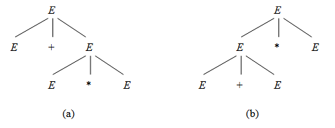

<ins> ***L’esistenza di varie Derivazioni di per se non è pericolosa, è l’esistenza di vari Alberi Sintattici che rovina la Grammatica***. <ins>

### Ambiguità

Sia $G = (V, T, P, S)$ una **CFG**, diciamo che $G$ è **Ambigua** se esiste una **Stringa** in $T^∗$ che ha piu’ di un **Albero Sintattico**.

Se ogni Stringa in $L(G)$ ha un unico **Albero Sintattico**, $G$ è detta **Non-Ambigua**.

Ad un **Albero Sintattico** corrispondono molte **Derivazioni**, ma:
- ad ogni (diverso) **Albero Sintattico** corrisponde un’unica (diversa) **Derivazione a Sinistra**.
- ad ogni (diverso) **Albero Sintattico** corrisponde un’unica (diversa) **Derivazione a Destra**.

Data una **CFG** $G$, una **Stringa Terminale** $w$ ha **due distinti Alberi Sintattici** se e solo se $w$ ha due **distinte Derivazioni a Sinistra** dal simbolo iniziale.

Un **CFL** $L$ è **inerentemente Ambiguo** se tutte le **Grammatiche** per $L$ sono **Ambigue**.

---

# Automi a Pila

## Definizione

Un **Automa a Pila** (**PDA** o ***Push Down Automaton***) è in pratica un **ϵ-NFA** con una **Pila**.

In una transizione un PDA:
1. Consuma un **simbolo di input** o esegue una **transizione** $ϵ$.
2. Va in un **nuovo Stato** o **rimane dove è**.
3. Rimpiazza il **top della Pila con una Stringa** (consuma il carattere in cima, e mette al suo posto una stringa, eventualmente vuota o uguale al carattere consumato lasciando quindi la pila inalterata)

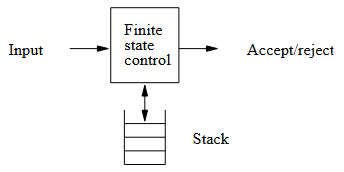

### Definizione Formale di PDA

Un **PDA** è una tupla di 7 elementi:

$$P = (Q, Σ, Γ, δ, q_0, Z_0, F)$$

dove:
- $Q$ è un **Insieme Finito di Stati**,
- Σ è un **Alfabeto Finito di Input**,
- Γ è un **Alfabeto Finito di Pila**,
- δ è una **Funzione di Transizione** da $Q×(Σ∪{ϵ})×Γ$ a **Sottinsiemi** di $Q × Γ^∗$, perché **Non Deterministico**,
- $q_0$ è lo stato iniziale,
- $Z_0 ∈ Γ$ è il **Simbolo Iniziale per la Pila**,
- $F ⊆ Q$ è l’**Insieme degli Stati di Accettazione**.

## Descrizioni Istantanee

Un **PDA** passa da una **configurazione** ad un’altra:
• Consumando un **Simbolo di Input** o tramite **Transizione** $ϵ$,
• Consumando la **Cima dello Stack** sostituendolo con una **Stringa**, eventualmente vuota.

Per ragionare sulle **computazioni dei PDA**, usiamo delle **Descrizioni Istantanee**, o **ID**, del **PDA**.

### Definizione Formale

Una **ID** è una tripla $(q, w, γ)$ dove $q$ è lo **Stato**, $w$ l’**Input Rimanente**, e $γ$ il **Contenuto della Pila**.

Sia $P = (Q, Σ, Γ, δ, q_0, Z_0, F)$ un **PDA**, allora:

$$∀w ∈ Σ^∗, β ∈ Γ^∗ : (p, α) ∈ δ(q, a, X) ⇒ (q, aw, Xβ) ⊢ (p, w, αβ)$$

Definiamo $\overset{∗}{⊢}$ la **Chiusura Riflessiva** e **Transitiva** di $⊢$.

## Accettazione per Stato Finale

Sia $P = (Q, Σ, Γ, δ, q_0, Z_0, F)$ un **PDA**, il **linguaggio accettato** da **P** per **Stato Finale**:

$$L(P) = \{w : (q_0, w, Z_0) \overset{∗}{⊢} (q, ϵ, α), q ∈ F\}$$

## Accettazione per Pila Vuota
Sia $P = (Q, Σ, Γ, δ, q_0, Z_0, F)$ un **PDA**, il **linguaggio accettato** da **P** per **Pila Vuota**:

$$N(P) = \{w : (q_0, w, Z_0) \overset{∗}{⊢} (q, ϵ, ϵ)\}$$

Nota: $q$ puo’ essere uno **Stato Qualunque**.

## Da Pila Vuota a Stato Finale

Se $L = N(P_N)$ per un **PDA** $P_N = (Q, Σ, Γ, δ_N , q_0, Z_0)$, allora esiste un **PDA** $P_F$, tale che:

$$L = L(P_F)$$  

### Dimostrazione

Sia:

$P_F=(Q ∪ \{p_0, p_f\}, Σ, Γ ∪ \{X_0\}, δ_F, p_0, X_0, \{p_f\})$

dove:
- $δ_F (p_0, ϵ, X_0)={(q_0, Z_0X_0)}$
- $\forall q ∈ Q, a ∈ Σ ∪ \{ϵ\}, Y ∈ Γ : δ_F(q, a, Y)=δ_N(q, a, Y)$
- $(p_f, ϵ) ∈ δ_F(q, ϵ, X_0)$

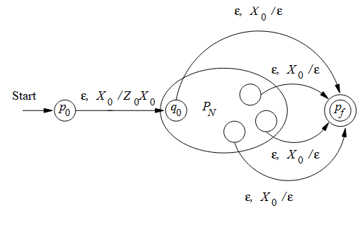

## Da Stato Finale a Pila Vuota

Se $L = N(P_F)$ per un **PDA** $P_F = (Q, Σ, Γ, δ_F , q_0, Z_0, F)$, allora esiste un **PDA** $P_N$, tale che:

$$L = N(P_N)$$

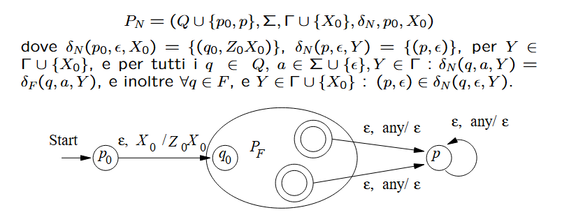

## Equivalenza di PDA e CFG

Un **Linguaggio** è **generato** da una **CFG** se e solo se è **accettato** da un **PDA** per **Pila Vuota**, il che è valido se e solo se è **accettato** da un **PDA** per **Stato Finale**.

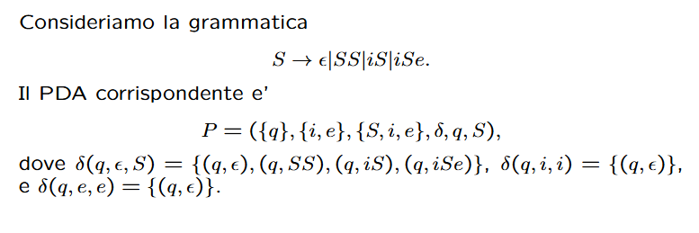

---

# PDA deterministici

## Definizione

Un **PDA** $P = (Q, Σ, Γ, δ, q_0, Z_0, F)$ è deterministico se e solo se:

- ogni $δ(q, a, X)$, con $a ∈ Σ ∪ \{ϵ\}$, contiene **al più un elemento**
- se $δ(q, a, X)$ **non vuoto** per un $a ∈ Σ$, allora $δ(q, ϵ, X)$ **vuoto**

## DPDA che accettano per Stato Finale
Mostreremo che Regolari ⊂ L(DPDA) ⊂ CFL

Se $L$ è **Regolare**, allora $L = L(P)$ per qualche **DPDA** $P$.

Dato che L è **Regolare**, esiste un DFA A tale che L = L(A).

Sia $A = (Q, Σ, δ_A, q_0, F)$ definiamo il **DPDA** $P = (Q, Σ, \{Z_0\}, δ_P , q_0, Z_0, F)$, dove:

$$δ_P(q, a, Z_0) = {(δ_A(q, a), Z_0)}$$

per tutti i $p, q ∈ Q$ e $a ∈ Σ$.

Un’induzione su $|w|$ ci da

$$(q_0, w, Z_0) \overset{*}{⊢} (p, ϵ, Z_0) ⇔ \hat{δ}_A(q_0, w) = p$$

Abbiamo visto che **Regolari** $⊆ L(DPDA)$.
• $L_{wcwr} ∈ L(DPDA)$ \ Regolari
• Ci sono linguaggi in $CFL$ \ $L(DPDA)$.

## DPDA che accettano per Pila Vuota

Possono riconoscere solo **Linguaggi con la Proprietà del Prefisso**.

Un **Linguaggio** $L$ ha la **Proprietà del Prefisso** se **non esistono due Stringhe Distinte in $L$, tali che una è un Prefisso dell’altra**.

$L$ è $N(P)$ per qualche **DPDA** $P$ se e solo se $L$ ha la **Proprietà del Prefisso** e $L$ è $L(P')$ per qualche **DPDA** $P'$.

## DPDA e non ambiguità

$L(DPDA)$ coincide con i **CFL** aventi **Grammatiche non Ambigue**? ***NO***

l’inverso invece vale!

Se $L=N(P)$ per qualche **DPDA** $P$, allora $L$ ha una **CFG non ambigua**.

Applicando la costruzione vista da **PDA** a **CFG**, se la costruzione è applicata ad un **DPDA**, il risultato è una **CFG con Derivazioni a Sinistra Uniche per ogni Stringa**.

Se $L=L(P)$ per qualche **DPDA** $P$, allora $L$ ha una **CFG non ambigua**.

Sia $\$$ un simbolo fuori dell’**Alfabeto** di $L$, e sia $L' = L\{\$\}$.

E’ facile modificare $P$ per riconoscere $L'$ (PDA ancora deterministico); inoltre $L'$ ha la **Proprietà del Prefisso**.

Per il teorema 6.19 abbiamo $L'=N(P')$ per qualche **DPDA** $P'$.
Per il teorema 6.20 $L'$ può essere generato da una **CFG non ambigua** $G'$.

Modifichiamo $G'$ in $G$, tale che $L(G) = L$, aggiungendo la produzione

$$\$ → ϵ$$

(e considerando \$ una variabile anziche’ un terminale)

Dato che $G'$ ha **Derivazioni a Sinistra Uniche**, anche $G$ le avrà uniche, dato che l’unica cosa nuova è l’aggiunta di derivazioni

$$w\$ \underset{lm}{⇒}w$$

Il $ è la nostra **EOF**

fai fino a fine pdf.

---

# Linguaggi di Programmazione

## Struttura di un compilatore

1. Scanning (Analisi Lessicale)
2. Parsing (Analisi Sintattica)
3. Type checking (Analisi Semantica)
4. Ottimizzazione
5. Generaizone di Codice

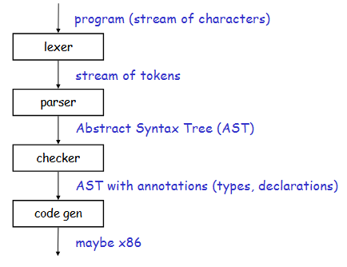

### Analisi Lessicale (Lexical Analysis)

Il **Compilatore** prende il testo del programma, cioè solo una sequenza di caratteri, e lo divide in **token**, come parole chiave, nomi di variabili, numeri, simboli.

Esempio:
`if x == y then z = 1; else z = 2;`
Questo diventa:
`IF | ID(x) | == | ID(y) | THEN | ID(z) | = | 1 | ; | ELSE | …`

Gli obbiettivi finali di questa fase sono:
- Suddividere le stringhe di input in delle sottostringhe dette **Lessemi**
- Classificare i **Lessemi** in base al loro **Ruolo**, detto anche **Token**

Alcuni **Token** possono avere anche degli attributi come il **Lessema** o il suo **Numero di Linea**.

### Analisi Sintattica (Parsing)

Una volta ottenuti i token, bisogna capire **se sono disposti in modo corretto**, cioè secondo la grammatica del linguaggio, questo è compito del **parser**.

L’analisi sintattica costruisce una struttura ad albero:
- **Parse Tree** (albero della grammatica concreta)
- **AST – Abstract Syntax Tree**, versione semplificata usata per le fasi successive.

## Lexer

### Come creare un Lexer

Scrivere un Lexer a mano è possibile, ma diventa complicato ed è prono ad errori.

Per questo esistono strumenti di generazioni che forniti **Lessemi** e **Token** ci ritorna un **Lexer**.

### Lexer Dichiarativo

Un **Lexer Dichiarativo** è composto da 2 parti, la parte **Dichiarativa**, descrive ogni **Token** come un **Automa Finito** o un'**Espressione Regolare**, e una **Imperativa**, connette gli **Automi** precedenti in un **Automa Lexer**.

## Parser

Un **Parser** si occupa di due task:
- **Controllo Sintatttico**, un programma con degli Errori Sintattici viene rifiutato e vengono fornite informazioni riguardo all'errore
- **Parsare la Costruzione dell'Albero**

### Parser a Discesa Ricorsiva

Sono dei **Parser** che sfruttano la **Ricorsione** per ottenere l'**Albero di Derivazione**.

Partano dal **Primo Elemento Non Terminale della Grammatica** e procedono in maniera **Ricorsiva**, supponendo che il **Carattere Terminatore** $\$$ sia posto al **Termine della Stringa di Input**

Il **Parsing** ha **Successo** se, alla fine dell'esecuzione, l'ultimo elemento punta a $\$$.

***Facile da realizzare ma non sempre funzionante.***

### Parser Predittivi

Sono un'**alternativa più efficente** ai normali **Parser Ricorsivi**, si basano sull'abilità del **Parser** di "**Predire**" le **successive Operazioni** che quest'ultimo deve compiere, **senza effettuare Backtracking**.

I Parser Predittivi accettano le **Grammatiche LL(k)**, ovvero le grammatiche che leggono da **Sinistra a Destra** (“left-to-right”) con **Derivazione a Sinistra** che predicono i **primi $k$ elementi**.

LEGGI LE SLIDE

---

# Analisi Semantica

## 
