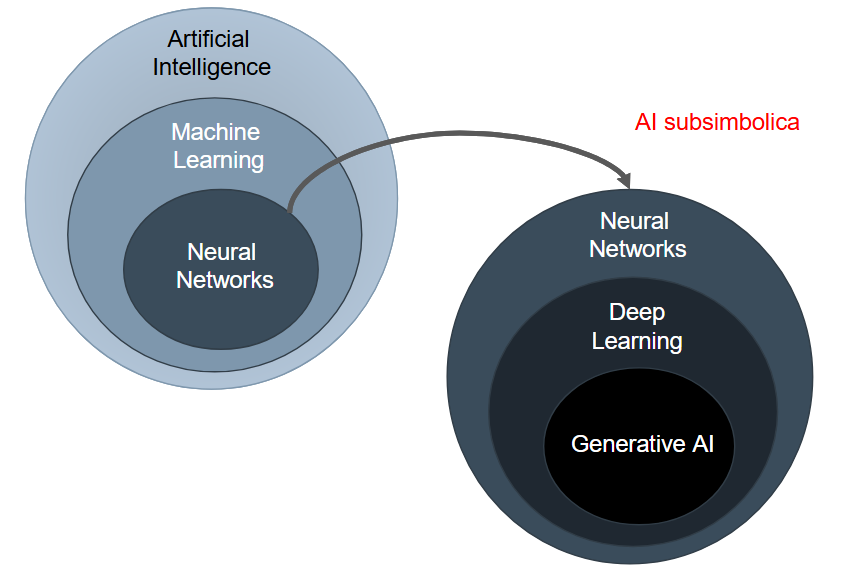
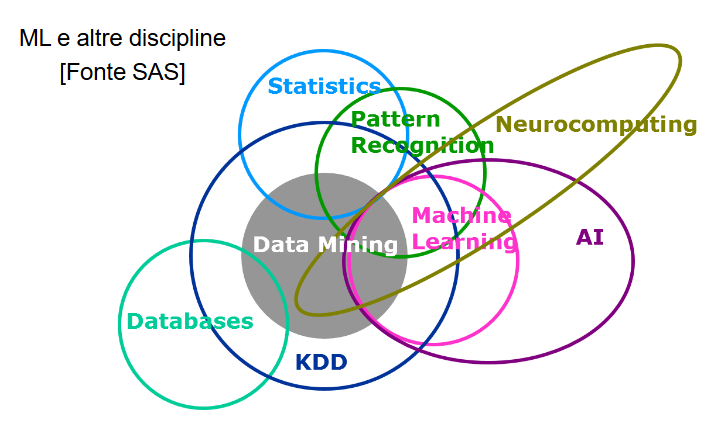

# Introduzione

## Inteligenza VS Inteligenza Artificiale
- **Intelligenza**: Complesso di facoltà psichiche e mentali che consentono all’uomo di pensare, comprendere o spiegare i fattio le azioni, elaborare modelli astratti della realtà, intendere e farsi intendere dagli altri, giudicare, e lo rendono insieme capace di adattarsi a situazioni nuove e di modificare la situazione stessa quando questa presenta ostacoli all’adattamento.

- **Intelligenza artificiale**: Riproduzione parziale dell’attività
intellettuale propria dell’uomo (con particolare riguardo ai
processi di apprendimento, di riconoscimento, di scelta)
realizzata o attraverso l’elaborazione di modelli ideali, o,
concretamente, con la messa a punto di macchine che
utilizzano per lo più a tale fine elaboratori elettronici.
Pensare, comprendere, elaborare → Ragionare

## Ragionamento Deduttivo

Nel **Ragionamento Deduttivo** (o ***Sillogismo***, Aristotele) la verità delle premesse, il **Caso Generale**, garantisce la verità della conclusione, il **Caso Particolare**.

REGOLA (C → R): Tutti gli uomini sono mortali

CASO (C1): Socrate è un uomo

quindi

RISULTATO (R1): Socrate è mortale

Il **Ragionamento Deduttivo** è il fondamento di gran parte delle **Dimostrazioni** e **Teoremi** , ma ***non ci permette di scoprire o prevedere nuovi fatti***.

## Ragionamento Induttivo

Nel **Ragionamento Induttivo**, le **Premesse**, il **Caso Particolare**, forniscono un’**evidenza** più o meno forte a sostegno della **conclusione**, il **Caso Generale**, ma ***non ne garantiscono necessariamente la verità***.

Il **Ragionamento Induttivo** è quindi un **Ragionamento Probabilistico**, le cui conclusioni dipendono dal **Grado di Probabilità** delle informazioni contenute nelle **premesse**.

CASO (C1): Socrate era un uomo

RISULTATO (R1): Socrate morì

quindi

REGOLA (C → R): Tutti gli uomini sono mortali

### Da rivedere
---

La forma più comune di ragionamento induttivo è la
generalizzazione, con cui otteniamo informazioni su un gruppo di
cose, persone, eventi, oggetti e così via, esaminando una porzione
– o campione – di quel gruppo.

**Ragionamento per Analogia**, che consiste nel trarre conclusioni su qualcosa in base alle sue somiglianze con qualcos’altro.
Usato nel ***Machine Learning***

Questo permette agli esseri umani di:
- utilizzare metafore
- -astrarre concetti «portandoli» da un domino all’altro
- essere creativi

## Ragionamento Abduttivo

Anche in questo caso il ragionamento è probabilistico, ma invece di generalizzare ci si muove «lateralmente», ipotizzando che un’implicazione valga anche al contrario.

REGOLA (C → R): Tutti gli uomini sono mortali

RISULTATO (R1): Socrate morì

quindi

CASO (C1): Socrate era un uomo

induzione per scienziati, l’abduzione per investigatori…

Ad Esempio:
Ragionamento di Sherlock Holmes e dr. House (cui interessa scoprire il caso in situazione di incertezza e non la regola generale).

## Inteligenza Artificiale e Machine Learning

Ascolta audio

---

## Machine Learning

Un **Modello** di **Machine Learning** :

***“Impara dagli esempi a migliorare le proprie prestazioni per la gestione di nuovi dati provenienti dalla stessa sorgente”*** (Mickey 91).

## Perché Machine Learning ?

- Consente di **gestire la complessità** di applicazioni reali, talvolta troppo complesse per poter essere modellate efficacemente.

- **Apprendere il comportamento** desiderato dai dati/esempi forniti, semplifica lo sviluppo di applicazioni.

- Rende possibile **esplorare** e **comprendere** i **dati** (***Mining***) senza la necessità di programmazione esplicita.

- **Addestramento end-to-end** (es. Guida automatica veicolo).

- **Deep Learning** e **Generative AI**

## Intelligenza Artificiale e “forza bruta”

***Brute-Force***: in alcuni domini applicativi un calcolatore è in grado di risolvere problemi in modo ottimo semplicemente **enumerando** e **valutando** tutte le **possibili alternative**.

Nella maggior parte dei casi però la valutazione esaustiva di tutte le possibili soluzioni **non è computazionalmente gestibile**, e si usano tecniche di ricerca che utilizzano **euristici** per ridurre il numero di casi da valutare.

Talvolta si utilizza il termine ***Weak AI*** per caratterizzare **sistemi capaci di risolvere problemi complessi senza però capacità di ragionamento e comprensione**.

---

# Fondamenti

## Dati e Pattern

I **Dati** sono un **elemento fondamentale** del **Machine Learning**, dove il comportamento dei **Modelli** non è pre-programmato ma **appreso**.

Un **Campione di Dati** nel **Dominio di Interesse** è definito ***Data-point***.

Utilizzeremo spesso come **sinonimo** di ***Data-Point*** il termine **Pattern**.

## Tipi di Pattern

### Numerici

Valori associati a **caratteristiche misurabili** o conteggi.

Tipicamente **continui** e **soggetti a ordinamento**, rappresentabili naturalmente come **vettori numerici** nello spazio multidimensionale.

L’**estrazione di caratteristiche** da segnali produce **vettori numerici** detti anche ***Feature Vectors***.

### Categorici
Valori associati a **caratteristiche qualitative** e alla **presenza o assenza di una caratteristica**.

Naturalmente gestiti da **sistemi a regole** e **alberi di classificazione**.

Con tecniche di **encoding** o **embedding** è possibile **mapparli su numeri**.

## Sequenze e altri dati strutturati

Le **Sequenze** sono **Pattern sequenziali** con **relazioni spaziali** o **temporali**.

La **posizione nella sequenza** e le **relazioni con predecessori** e **successori** sono **importanti**.

## Dati Tabulari

In molte applicazioni aziendali, i **dati** sono organizzati in una **tabella**, nelle cui **colonne** troviamo gli **attributi** (*features*) e nelle **righe** i **record** (*data point*).

Le **colonne** possono avere formato **numerico** o **categorico**, sono **eterogenee**.

I **dati** possono essere **incompleti** e **fortemente sbilanciati**.

## Encoding

***One-hot Encoding***: si rimuove il campo e al suo posto si aggiungono tanti campi quanti sono i valori distinti.

***Ordinal encoding***: si trasforma il campo originale in campo numerico associando ai materiali dei valori ordinali.

## Classificazione

**Classificazione**: assegnare una **classe** a un **pattern**.

Necessario apprendere una **funzione** capace di eseguire il **mapping dallo spazio dei pattern allo spazio delle classi**.

Nel caso di 2 sole classi si usa il termine ***binary classification***, con più di due classi ***multi-class classification***.

**Classe**: insieme di **pattern aventi proprietà comuni**.

## Regressione

**Regressione**: assegnare un **valore continuo** a un **pattern**, utile per la **predizione di valori continui**.

Risolvere un **problema di regressione** corrisponde ad **apprendere una funzione**approssimante delle coppie «input,output» date.

### Clustering

**Clustering**: **individuare gruppi**, detti **cluster**, di **pattern con caratteristiche simili**.

Le **classi** del problema **non sono note** e i **pattern non etichettati**, la natura non supervisionata del problema lo rende più complesso della classificazione.

## Riduzione Dimensionalità

**Riduzione di dimensionalità**: ridurre il numero di **dimensioni** dei **pattern in input**.

L’**operazione** comporta una **perdita di informazione**, bisogna evitare di perdere **dati importaniti**.

## Feature Engineering

Il successo di molte **applicazioni di machine learning** dipende dall’**efficacia di rappresentazione dei pattern in termini di features**.

La **definizione di features ad-hoc** per le diverse applicazioni prende il nome di ***feature engineering***.

## Modelli Discriminativi vs Generativi

I **modelli discriminativi** (classificatori) hanno l’obiettivo **diassegnare un nuovo datapoint a una classe**.

La cosa importante è apprendere il **decision boundary che separa le classi**.

I **modelli generativi** apprendono (esplicitamente/implicitamente) la **distribuzione probabilistica degli esempi** usati per il loro addestramento.

Dopo l’addestramento, possono:
- **generare nuovi dati sintetici** a partire da numeri random
- **modificare** o **trasformare l’input** fornito
- **classificare l’input** comparando le probabilità che sia generato dalle diverse classi

## Apprendimento

**Supervisionato** (Supervised): sono **note le classi dei pattern** utilizzati per l’**addestramento**, il **training set è etichettato**.

**Non Supervisionato** (Unsupervised): **non sono note le classi dei pattern** utilizzati per l’**addestramento**, il **training set non è etichettato**.

**Semi-Supervisionato** (Semi-Supervised): il **training set è etichettato parzialmente**,
la **distribuzione dei pattern non etichettati** può aiutare a **ottimizzare la regola di classificazione**.

## Batch, Incrementale, Naturale

**Batch**: l’addestramento è effettuato una sola volta su un training set dato. Una volta terminato il training, il sistema passa in «working mode» e non è in grado di apprendere ulteriormente.

**Incrementale**: a seguito dell’addestramento iniziale, sono possibili ulteriori sessioni di addestramento.

**Scenari**: Sequenze di Batch, Unsupervised Tuning. Catastrofic Forgetting (il sistema dimentica quello che ha appreso in precedenza).

**Naturale**: Addestramento continuo (per tutta la vita). Addestramento attivo in working mode. Coesistenza di approccio supervisionato e non supervisionato.

