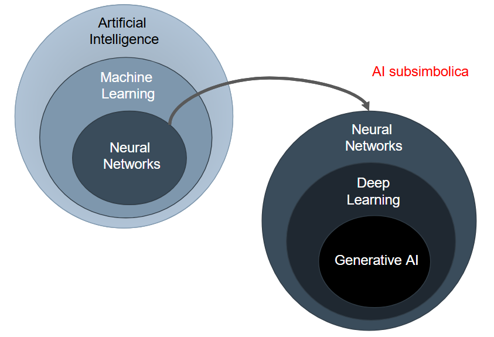

# Introduzione

## Inteligenza VS Inteligenza Artificiale
- **Intelligenza**: Complesso di facoltà psichiche e mentali che consentono all’uomo di pensare, comprendere o spiegare i fattio le azioni, elaborare modelli astratti della realtà, intendere e farsi intendere dagli altri, giudicare, e lo rendono insieme capace di adattarsi a situazioni nuove e di modificare la situazione stessa quando questa presenta ostacoli all’adattamento.

- **Intelligenza artificiale**: Riproduzione parziale dell’attività
intellettuale propria dell’uomo (con particolare riguardo ai
processi di apprendimento, di riconoscimento, di scelta)
realizzata o attraverso l’elaborazione di modelli ideali, o,
concretamente, con la messa a punto di macchine che
utilizzano per lo più a tale fine elaboratori elettronici.
Pensare, comprendere, elaborare → Ragionare

## Ragionamento Deduttivo

Nel **Ragionamento Deduttivo** (o ***Sillogismo***, Aristotele) la verità delle premesse, il **Caso Generale**, garantisce la verità della conclusione, il **Caso Particolare**.

REGOLA (C → R): Tutti gli uomini sono mortali

CASO (C1): Socrate è un uomo

quindi

RISULTATO (R1): Socrate è mortale

Il **Ragionamento Deduttivo** è il fondamento di gran parte delle **Dimostrazioni** e **Teoremi** , ma ***non ci permette di scoprire o prevedere nuovi fatti***.

## Ragionamento Induttivo

Nel **Ragionamento Induttivo**, le **Premesse**, il **Caso Particolare**, forniscono un’**evidenza** più o meno forte a sostegno della **conclusione**, il **Caso Generale**, ma ***non ne garantiscono necessariamente la verità***.

Il **Ragionamento Induttivo** è quindi un **Ragionamento Probabilistico**, le cui conclusioni dipendono dal **Grado di Probabilità** delle informazioni contenute nelle **premesse**.

CASO (C1): Socrate era un uomo

RISULTATO (R1): Socrate morì

quindi

REGOLA (C → R): Tutti gli uomini sono mortali

### Da rivedere
---

La forma più comune di ragionamento induttivo è la
generalizzazione, con cui otteniamo informazioni su un gruppo di
cose, persone, eventi, oggetti e così via, esaminando una porzione
– o campione – di quel gruppo.

**Ragionamento per Analogia**, che consiste nel trarre conclusioni su qualcosa in base alle sue somiglianze con qualcos’altro.
Usato nel ***Machine Learning***

Questo permette agli esseri umani di:
- utilizzare metafore
- -astrarre concetti «portandoli» da un domino all’altro
- essere creativi

## Ragionamento Abduttivo

Anche in questo caso il ragionamento è probabilistico, ma invece di generalizzare ci si muove «lateralmente», ipotizzando che un’implicazione valga anche al contrario.

REGOLA (C → R): Tutti gli uomini sono mortali

RISULTATO (R1): Socrate morì

quindi

CASO (C1): Socrate era un uomo

induzione per scienziati, l’abduzione per investigatori…

Ad Esempio:
Ragionamento di Sherlock Holmes e dr. House (cui interessa scoprire il caso in situazione di incertezza e non la regola generale).

## Inteligenza Artificiale e Machine Learning

Ascolta audio

---

## Machine Learning

Un **Modello** di **Machine Learning** :

***“Impara dagli esempi a migliorare le proprie prestazioni per la gestione di nuovi dati provenienti dalla stessa sorgente”*** (Mickey 91).

## Perché Machine Learning ?

- Consente di **gestire la complessità** di applicazioni reali, talvolta troppo complesse per poter essere modellate efficacemente.

- **Apprendere il comportamento** desiderato dai dati/esempi forniti, semplifica lo sviluppo di applicazioni.

- Rende possibile **esplorare** e **comprendere** i **dati** (***Mining***) senza la necessità di programmazione esplicita.

- **Addestramento end-to-end** (es. Guida automatica veicolo).

- **Deep Learning** e **Generative AI**

## Intelligenza Artificiale e “forza bruta”

***Brute-Force***: in alcuni domini applicativi un calcolatore è in grado di risolvere problemi in modo ottimo semplicemente **enumerando** e **valutando** tutte le **possibili alternative**.

Nella maggior parte dei casi però la valutazione esaustiva di tutte le possibili soluzioni **non è computazionalmente gestibile**, e si usano tecniche di ricerca che utilizzano **euristici** per ridurre il numero di casi da valutare.

Talvolta si utilizza il termine ***Weak AI*** per caratterizzare **sistemi capaci di risolvere problemi complessi senza però capacità di ragionamento e comprensione**.

