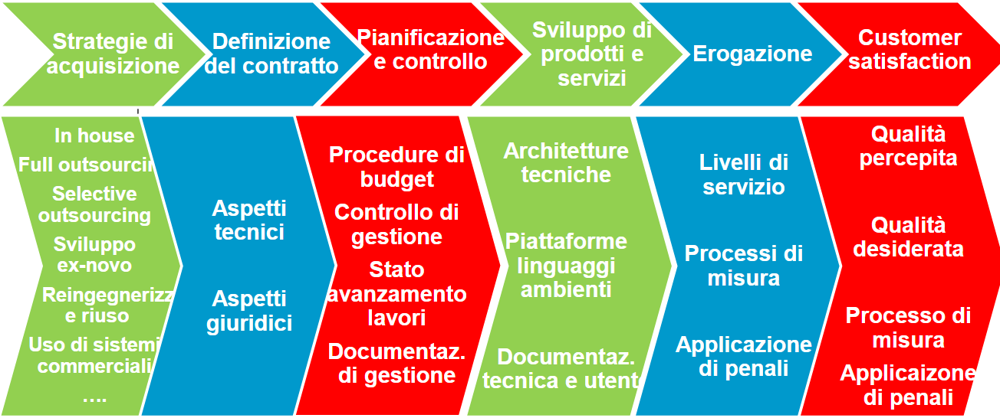

# Sruttura Aziendale

## Struttura Organizzativa

Rappresenta la divisione dell’impresa in differenti Unità Organizzative, i legami gerarchicivengono descritti tramite reticoli che delineano responsabilitaà e funzioni.

Possono essere:
- **DIVISIONALI** = Le persone vengono raggruppate in base al prodotto o servizio (Tipico delle big)
- **FUNZIONALI** = Le persone vengono raggruppate in base ai compiti svolti
- **MATRICIALI** = Struttura ibrida fra le due precedenti

### Unità Organizzative

Gruppi all'interno di un azienda ai quali sono attribuiti compiti ed obiettivi specifici e che cooperano attraverso legami di tipo gerarchico e funzionale.

### Suddivisione delle Mansioni

- ***Strategic*** : Si concentra sulle **Attività** necessarie per garantire un posizionamento competitivo e una **strategia a lungo termine**.

- ***Middle*** : Implementa i **Piani Strategici** e garantire che le **Attività Quotidiane** siano conformi alla **Strategia Aziendale**.

- ***Operational*** : È legato alle **Operazioni a breve termine** di un'azienda, riguarda l'**implementazione di Beni e Servizi**.

## Processo

Un insieme delle Attività tra loro interconnesse, finalizzate alla realizzazione di un risultato definito.

### Sistema Informativo vs Sistema Informatico

***Sistema Informativo*** = L’insieme delle informazioni gestite, generate, utilizzate e elaborate dai Processi aziendali e le Modalità per la loro gestione.

***Sistemi Informatici*** = La porzione del Sistema Informativo in cui le Informazioni sono raccolte, elaborate, archiviate e scambiate mediante l’uso di Tecnologie Informatiche.

### Efficenza vs Efficacia

***Efficenza*** = Misura il valore dell'output effettivo rispetto all'input.

***Efficacia*** = Aspettative vs Realtà.

# Evoluzione dei Sistemi Informatici

## Fase I - Automazione

Automazione delle attività di **raccolta**, **archiviazione** e **reperimento** dei **Dati di natura Operativa** (es. stipendi, gestione ordini, fatturazione, ecc.).

## Fase II - Business Inteligence

Automazione delle attività di **controllo** e **valutazione dell’andamento aziendale e delle scelte direzionali** (es. controllo della produzione, analisi what-if, gestione del budget, ecc.)

## Fase III - Integrazione

**Integrazione** con le **Applicazioni Settoriali**.

# Sistemi Informativi VS Basi di Dati

I concetti di **Sistemi Informativo** e di **DB** non devono essere considerati dei sinonimi.

La definizione e la gestione di un **Sistemi Informativo** richiede la perfetta conoscenza dei **Processi Aziendali**, **Informazioni necessarie ai Processi** e la **Struttura Aziendale**.

Mentre per progettare un **Sistemi Informativi** richiede competenze in ambito di **Organizzazione Aziendale**, **Economia** e **Psicologia**.

I **DB** sono quindi solo una **sottoporzione** del **Sistemi Informativo** atta alla **memorizzazione strutturata delle informazioni**, essendo queste il nucleo di tutti i **Sistemi Informativi** i **DB** rivestono un ruolo centrale. Dunque una **modellazione imprecisa** del **DB** implica lo **scorretto funzionamento** del **Sistemi Informativo**.

# Hype Cycle di Gartner

Il modello Hype Cycle è una metodologia sviluppata da Gartner, una società di consulenza, per rappresentare graficamente la maturità, l'adozione e l'applicazione di specifiche tecnologie.

---

# Catena del Valore di Porter

La catena del valore è un modello che permette di descrivere la struttura di una organizzazione come un insieme limitato di processi.

# Tipi di Sistema Informativo

## Sistemi Informativi Operativi

Sono **Sistemi Informativi** che **Informatizzano Processi** volti all’**esecuzione di Attività** o alla loro **programmazione**, ovvero automatizzano le attività quotidiane e i processi aziendali di base.

## Sistemi Informativi Direzionali

Supportano il **Processo Decisionale** fornendo informazioni ai **Manager** per aiutarli a prender decisioni.

I **Processi Direzionali** si differenziano da quelli **Operativi** poiché si basano su **Indici**, ovvero **informazioni aggregate** e **riassuntive**, l’elaborazione non è continua ma **periodica** e sono costruiti sopra i **SI Operativi** da cui estraggono le **Informazioni di Base**.

## Sistemi Informativi Analitici

Supportano la **comprensione dei Fenomeni di Business** e sono focalizzati su **Prodotti**, **Clienti** e **Processi**.

Permettono di **profilare i Clienti** studiando le relative **abitudini** e **comportamenti**, mantengono la **Storia del Prodotto** e permettono di **monitorarne l’Affidabilità**.

# Portafoglio Applicativo Aziendale

Mappa di esigenze informative dell'azienda, il portafoglio applicativo comprende le applicazioni utilizzate dai processi primari specificati dalla catena del valore.

## CRM (Customer Relationship Management)

La gestione delle relazioni con i clienti è un approccio strategico che integra tecnologie, processi e analisi dei dati per ottimizzare le interazioni di un'organizzazione con i suoi clienti.

## CIM (Computer Integrated Manufacturing)

Un'**Architettura Multilivello** che collega diversi livelli di un **Sistema di Produzione** ed è finalizzata all'**ottimizzazione dei processi** e alla **gestione delle risorse**.

## ERP (Enterprise Resource Planning)

Un Enterprise Resource Planning o ERP, è un software di gestione che integra tutti i processi aziendali e tutte le funzioni aziendali rilevanti.

Integra quindi tutte le attività aziendali in un unico sistema per supportare al meglio il management.

## MES (Manufacturing Execution Systems)

I **MES** permettono la **gestione della fabbrica nel suo complesso**, ricevono ordini dall'**ERP**, **raccolgono informazioni** dallo **SCADA** e **forniscono informazioni aggiornate** all'**ERP**.

## SCADA (Supervisory Control And Data Acquisition)

Il **sistema SCADA** (o ***Supervisory Control And Data Acquisition***) è la componente di un **sistema CIM** preposto al **controllo dei sistemi industriali, all’acquisizione e all’analisi dei dati da essi prodotti**

# Paradigma dell'ERP

## Unicità dell’Informazione

Tutte le elaborazioni condividono uno e un solo valore per ogni informazione

## Estensione e Modularità

L’ampiezza della copertura dei **Sistemi ERP** fa si che questi possano essere utilizzati come **unica soluzione** per il **Sistema Informativo**.

La **Modularità** del sistema permette all’azienda di scegliere solo i **moduli di interesse**.

## Prescrittività

Nei sistemi ERP, **i processi aziendali devono adattarsi** a quelli **predefiniti dal software**.

**E’ necessario far aderire i processi aziendali a quelli definiti nell’ERP**.

# Paradigma dei CRM

Le caratteristiche che denotano un sistema CRM possono essere così riassunte:
- **Multicanalità**: Il **cliente** sceglie di volta in volta il **Canale di Contatto più conveniente** ed il **Servizio** deve essere **erogabile 24h**.
- **Completezza e Unicità dei Dati** su prodotti e clienti: Per rendere possibile la **Multicanalità** le **Informazioni sul Cliente** devono essere **condivise dai diversi Sistemi di Contatto** che utilizzeranno una **DB comune**.
- **Catene di Servizio**: Le **richieste** sottoposte ai **Front-End** generano una serie di **Attività** complesse sui sistemi di **Back-End**.

L’**Efficienza del Sistema CRM** dipende quindi dalla **capacità di integrare i Servizi del SI**.

---

# Legge di Martec

Nella maggior parte dei **Processi Innovativi** sono le **Persone** e i **Processi** a **frenare l’Innovazione** a causa dell’**avversione all’Innovazione** e alla **legge di Martec**

"La tecnologia cambia in maniera esponenziale, mentre le organizzazioni cambiano in maniera logaritmica"

Questo fenomeno può determinare un **senso di Inadeguatezza** con conseguente **avversione all’Innovazione Tecnologica**.

# Law of Accelerating Returns di Ray Kurzweil

Un **Concetto** per descrivere come il **Progresso Tecnologico** tenda ad **accelerare in modo Esponenziale**, anziché lineare, nel tempo.

Questo accade perché ogni **Innovazione Tecnologica** fornisce gli strumenti per **sviluppare ulteriori innovazioni** a un ritmo sempre più rapido.

# Il ciclo di Deming

Sintetizza la **Logica** secondo la quale **gestire il Ciclo di Innovazione**.

L’adozione di un **Ciclo di Pianificazione e Controllo** è il primo passo per mantenere attuale il **Sistema Informativo** minimizzando i **rischi di Incoerenza** e i **Costi di Realizzazione**.

## Pianificazione

- La **Formalizzazione delle Strategie**;
- La **Scelta delle Priorità** nell’attuazione dei vari **Interventi di Automazione**;
- La **Validazione dei Progetti** da attivare;
- La **Definizione degli Impegni e delle Risorse necessarie**, sia per i **Progetti**;
- La **Stesura del Documento di Piano** e la correlata **Definizione del Budget e delle Responsabilità**.

## Realizzazione

- L’**Elaborazione di Studi di Fattibilità** per tutti i **Progetti**;
- La **Definizione di Progetti Esecutivi e di Piani Operativi** per i progetti previsti e per le **Attività di Conduzione, Manutenzione ed Evoluzione dei Sistemi**;
- L’**Acquisizione di Prodotti e Servizi dal Mercato**, con la **gestione delle Procedure**;
- La **Realizzazione dei Progetti**;
- La **Conduzione Operativa dei Sistemi**, con l’**Erogazione dei Servizi Informativi** previsti, insieme alla correlata **Attività di Manutenzione**;

## Verifica

- La **Gestione dei Progetti nelle loro varie Componenti** (attività, risorse, ecc.);
- La **Raccolta di Informazioni sullo Stato dei Processi di Servizio**, con **Attività di Raccolta e Osservazione** di misure ed eventi capaci di **evidenziare** e **quantificare** la **situazione di Efficacia ed Efficienza dei Servizi e dei Processi** per la loro erogazione;
- La **Diagnosi di Servizi e Processi** che, sulla base delle **Informazioni raccolte**,
evidenzia i **problemi** identificandone le **cause** indicando le **Direzioni di Intervento** per il cambiamento;
- La **Raccolta di Informazioni sullo Stato dei Sistemi Informativi Automatizzati** in termini di **Patrimonio Tecnologico**, **Patrimonio Informativo**, **Stato delle DB**, **Patrimonio Applicativo**, ecc.
- La **Diagnosi della Risorsa Informazione**, in primo luogo come **Livello di Qualità delle
Basi Informative** presenti, soprattutto in termini di **Correttezza**, **Completezza** e
**Disponibilità delle Informazioni**. Questa **Diagnosi** si può sviluppare in **maniera Integrata** con la **Diagnosi dei Processi**, per le informazioni di pertinenza di specifici processi o aree tematiche, o in **Maniera Indipendente**, considerando la **Risorsa Informazione** come risorsa a disposizione di una pluralità di processi;
- La **Diagnosi dei Sistemi Informatici**, in termini **Funzionali** e **Organizzativi**, **Architetturali** e **Tecnologici**, o **Economici**.

## Intervento

- L’**Elaborazione degli Interventi di Reingegnerizzazione dei Processi di Servizio**, definendo in particolare i **Requisiti di Fondo** per lo sviluppo e la **Revisione dei Sistemi Applicativi**;
- L’**Individuazione di Iniziative di Reingegnerizzazione dei Sistemi Informatici** che si concretizzano in **Programmi di Adeguamento** delle **Infrastrutture Informatiche**;

# Definizione degli Obbiettivi

Per raggiungere gli **obiettivi aziendali**, questi devono essere **individuati e formalizzati**, definendo **responsabilità**, **tempi** e **priorità**.

A tale scopo viene redatto il **Piano di Informatizzazione**, approvato dai **livelli decisionali più alti** per garantirne la rilevanza.

## Piano Strategico

Di durata tipica tra i 3 e 5 anni, il suo scopo è quello di assicurare coerenza e integrazione tra le iniziative informatiche, evitando sistemi frammentati o incompatibili.

## Piano Operativo

Di durata annuale, il suo scopo è dettagliare gli interventi concreti previsti dal piano strategico per l’anno in corso.

## Top Down VS Bottom Up

***Top Down***:

- Partendo dagli **Obiettivi Strategici dell’Organizzazione** si definiscono le **Caratteristiche Generali del Sistema Informativo**, le **Aree di Intervento** e gli specifici **Progetti per Realizzarlo**, verificandone la **Coerenza con le Esigenze espresse** dagli uffici
- Maggiormente **Innovativo** e **Discontinuo**.
- Permette di **Identificare** e **Pianificare Soluzioni** che rispondono a necessità di **Mutamenti Radicali**.
- Causa maggiori **Tensioni** e **Rischi Organizzativi**.

***Bottom Up***:

- Partendo dalle **Indicazioni delle diverse Unità Organizzative**, che successivamente vengono **Integrate** e **Razionalizzate**, definendo contemporaneamente le **Priorità all’interno del Budget Complessivo**.
- Maggiormente **Conservativo**
- Difficilmente riesce a produrre ipotesi di **Innovazione Radicale**, mirando sostanzialmente al **Miglioramento dell’Esistente**.
- Presenta **scarsi Rischi Realizzativi**.

# Il BPR (Business Process Reengineering)

Il **BPR**, o ***Business Process Reenginering***, nasce come completo **ripensamento** e radicale **ridisegno** dei **fondamentali Processi di un’Organizzazione** alla luce delle **Potenzialità offerte dai nuovi Strumenti Informatici**.

Il **BPR** è la **completa Revisione dei Processi Aziendali** al fine di **massimizzarne il Valore** derivante dalle singole componenti, attraverso **Interventi sia di Riduzione dei Costi sia di Massimizzazione dell’Efficacia**.

## Tipi di Cambiamento

- ***Streamlining***: Ricerca il **miglioramento delle prestazioni** modificando il **Processo Attuale** (Pinaificazione al Presente).
- ***Business Process Reengineering***: Ricerca un **Cambiamento Radicale del Processo Attuale** (Pianificare il Futuro a Parità di Business).
- ***Enterprise Transformation***: Ricerca una **Riconfigurazione del Business** (Pianificare il Business).

## Fasi del BPR

- Identificazione dei **Processi da reingegnerizzare**:
  - Descrivere i **Processi**
  - Identificazione del **Breakthrough**
  - Analisi dei **Tempi di Ciclo**
  - Analisi della **Creazione del Valore**
- Definizione delle **Priorità di Intervento** sulla base del loro impatto (**Analisi di Pareto**)
- **Reingegnerizzione dei Processi** per rimuovere le **Barriere alla Performance**
- Implementazione del cambiamento
- Istituzionalizzazione delle misure per il miglioramento continuo

### Descrivere i Processi

La **Scomposizione dei Processi** dettaglia i processi per successivi livelli di approfondimento:

- **Macroprocesso**: Ne è un esempio la **Catena del Valore di Porter**. E' utile soprattutto nelle fasi iniziali per **strutturare l’Analisi** e per **individuare l’Area di Intervento**.
- **Processo**: Illustra a un livello ragionevolmente dettagliato le **Operazioni svolte da un’**azienda****.
- **Fase**: Una **Fase** è una **Tappa di un Processo** e ha lo scopo di **descrivere** il modo in cui **un Processo è Implementato**.
- **Attività**: è il livello adottato nella **Fase di Studio dei Processi**. Sono determinate **scomponendo ulteriormente le Fasi secondo una Logica Sequenziale**.

Le **Variabili di Progettazione** dei processi sono:

- **Flusso delle Attività** = La **Sequenza di Attività** attraverso cui il **Processo** è svolto, determina la **durata** e **incide sul Livello di Servizio** in base alle sua flessibilità ed assieme alle **Risorse Umane** e al **Livello della Tecnologia** determina la **Qualità dell’Output**.
- **Organizzazione del Processo** = Sia dal punto di vista della **Suddivisione Operativa del Lavoro**, sia della **Struttura di Coordinamento e Controllo Aziendale**, determina il **Livello di Accorpamento delle Attività**. (Il collegamento tra la struttura aziendale e i processi operativi può essere rappresentato con i Linear Responsibility Charting (LRC)).
- **Competenze delle Risorse Umane**.
- **Sistema di Misurazione e controllo delle prestazioni** = Si ottiene realizzando sistemi di ***Key Performance Indicator*** (**KPI**) o di **Balanced Scorecard**.

#### Linear Responsability Charting

Determina una **Visione Tabellare della Responsabilità Organizzativa**, si ottiene **incrociando le Attività del Processo con le Divisioni**.

Il **Ruolo** è indicato dalle **Etichette** inserite nelle celle della griglia risultante:
- D = decide, autorizza, ratifica
- E = esegue
- A = partecipa a tempo parziale, fornisce assistenza operativa e supporto
- I = informato sistematicamente

#### Key Performance Indicator

Per verificare l’**Efficacia del Processo** è necessario **misurare quantitativamente** come questo soddisfa i **Requisiti del Cliente**, ma per ogniuno di essi i requisiti variano.

Questa **Capacità di Soddisfare i Requisiti dei Clienti** si misura tramite i ***Key Performance Indicator***(**KPI**).

Un **KPI** è un **Indicatore Quantificabile dell’Efficacia e/o dell’Efficienza di un processo o di un sottoprocesso**.

Un **KPI** ha le seguenti caratteristiche:
- **Quantificabile**
- **Rilevabile**
- Correlato con l’**Obiettivo di Business Interno di Processo**

Per poter misurare un **Processo** tramite i **KPI** è necessario **crearne la mappa** ossia **Identificarne gli Output, gli Obiettivi e le Attività Principali**.

I **KPI** che devono essere definiti in base ai seguenti principi:

- **Significatività**
- **Controllabilità** (Valutabilità)
- **Semplicità**
- **Misurabilità**

Gli **Indicatori di Risultato** misurano la **Performance a un momento dato**, mentre gli **Indicatori Tecnici** misurano **Attività che influenzano la Performance**.

#### Overall Equipment Effectiveness

**OEE** è il **principale KPI** per misurare la **Capacità di Produzione di un'Azienda Manifatturiera**.

$$Availability\times Performance\times Quality$$

- **Availability** [0;1]: Percentuale di tempo lavorato rispetto al tempo disponibile.
- **Performance** [0;1]: Percentuale di pezzi effettivamente lavorati rispetto ai pezzi teoricamente lavorabili.
- **Quality** [0;1]: Rapporto percentuale dei pezzi conformi sul totale dei pezzi prodotti.

### L’identificazione dei Breakthrough

Esistono dei **Livelli di Performance di un Processo** il cui raggiungimento comporta un **miglioramento significativo** e più che proporzionale dei benefici.

Vi sono due modalità fondamentali per l’identificazione dei **Breakthrough**:

- La **Voce del Cliente**
- Il **Benchmarking**

#### Che succede se non si include la Voce del cliente in un progetto BPR?

- Potenziale rischio per l’organizzazione di non offrire ciò che il cliente vuole quando lo vuole
- Possibile perdita di posizionamento e in prospettiva perdita di clienti chiave
- Rischio di focalizzare il BPR su aree non a valore per il cliente
- Ambiente di lavoro fra i clienti interni stressante

### L’Analisi dei Tempi Ciclo

L'**Analisi dei Tempi di Ciclo** (o ***Cycle Time Analysis***) è una tecnica utilizzata per **misurare** e **ottimizzare** l'**efficienza dei processi produttivi** o **operativi**, analizzando il **tempo necessario per completare un ciclo di lavoro**.

Il **Tempo di Ciclo** può essere suddiviso in diverse fasi:
- **Tempo di Lavorazione** (***Processing Time***): Il **tempo effettivo** dedicato alla **realizzazione dell'attività** o del **prodotto**.
- **Tempo di Attesa** (***Waiting Time***): Il tempo durante il quale il **lavoro è in attesa** tra una fase e l'altra.
- **Setup Time**: Il tempo richiesto per preparare una **macchina** o un **processo** prima di iniziare il lavoro.
- **Tempo di Trasporto** (***Transport Time***): Il tempo impiegato per **spostare materiali** o **informazioni** da una fase all'altra.
- **Tempo di Inattività** (***Idle Time***): Periodi in cui **risorse** o **macchine non vengono utilizzate**.

Obiettivi dell'analisi
- **Identificare Colli di Bottiglia**
- **Ridurre i Tempi Morti**
- **Ottimizzare le Risorse**
- **Aumentare l'Efficienza Complessiva**

### L’Analisi di Pareto

L'**Analisi di Pareto** è uno **strumento statistico** utilizzato per **identificare e focalizzarsi** sugli elementi che hanno il **maggiore impatto** su un determinato **Fenomeno**.

***Si basa sul principio di Pareto, noto anche come legge 80/20, che afferma che circa l'80% degli effetti deriva dal 20% delle cause.***

L'**Analisi di Pareto** ha come obiettivo principale quello di **evidenziare le Cause Principali di un Problema**, per permettere alle organizzazioni di concentrarsi su quelle **aree che generano il maggior impatto**, piuttosto che dispersa risorse su **fattori meno significativi**.

Le Fasi dell'Analisi di Pareto sono:
- **Raccolta dei Dati**
- **Classificazione e Ordinamento**
- **Creazione di un Grafico di Pareto**: Si costruisce un **Grafico a Barre** in cui l'asse delle **x rappresenta le diverse Categorie**, l'asse delle **y mostra la Frequenza o l'Importanza** relativa di ogni categoria, e le barre sono ordinate dalla più alta alla più bassa.
- **Identificazione del "*20% cruciale*"**

## Rimuovere le Barriere alla Performance

Bisofgna sfruttare **Strumenti Analitici** che aiutano a concepire nuovi modi di organizzare il **Flusso di Lavoro**, per esempio:
- **Azienda Estesa** = Gestire i **Processi oltre i Confini Organizzativi dell’impresa**.
- **Parallelizzazione** = Sostituire **Processi Sequenziali** con **Processi Parallelizzati**.
- **Riallocazione**
- **Eliminazione**
- **Cicli di Miglioramento Continuo**

# I Ruoli della Tecnologia nell’Innovazione

L’**Information Technology** va strategicamente **interpretata come Fattore di Successo Ottimale** per le prestazioni dei processi di business, ma devono essere **sviluppate contestualmente** con il “**Modello d’Impresa**”.

La **Tecnologia** è un **Fattore Abilitante dell’Innovazione**, tuttavia abbiamo affermato più volte che è necessario **pensare alla Scelta delle Tecnologie di Implementazione DOPO avere fatto Innovazione su Processi e Informazioni**.

Ci sono 2 possibili soluzioni:
- **Innovazioni Tecnology-Driven** si basano su una **Tecnologie estremamente Innovative** tale per cui gli **Stake-Holder del Servizio/Problema non riescono neanche a immaginarne l’utilizzo**.
- **Innovazioni Application-Driven** si basano su una **Tecnologie Note** tale per cui gli **Stake-Holder del Servizio/Problema ne conoscono le Potenzialità**, l’**Innovazione** sta nel **immaginarsi l’utilizzo nello Specifico Contesto**.

---

# Data Flow Diagram

Un **Sistema** è visto come una **Rete di Processi Funzionali interconnessi da Depositi di Dati**.

I **DFD** enfatizzano le **Operazioni effettuate sulle Informazioni** e le **Dipendenze Funzionali** che vengono a crearsi fra i vari processi in base ai **Flussi di Informazione**.

I **Processi** possono essere:
- Definiti a qualunque **Livello di Astrazione**
- Raffinabili mediante **Scomposizione Gerarchica** in un **Insieme di Processi più Elementari**.

---

# Studio di Fattibilità

Parte dell'**Attuazione non di Pianificazione**, si fa solo se in fase di pianificazione viene proposto un **Progetto molto Importante o Innovativo** di cui **non sono chiari tutti gli Obbiettivi e le Complessità**.

L’obiettivo di uno studio di fattibilità non è quindi quello di individuare potenziali progetti, bensì quello di **dare Concretezza a un Progetto Pre-Identificato**.

<ins><mark>***Da evitare, non porta alcun vantaggio fornisce una Valutazione del Rischio, Stime, Benefici e Costi.***</mark></ins>

## Fasi dello Studio di Fattibilità

- Valutazione delle Alternative
- Analisi della situazione attuale
- Progetti di massima
- Analisi dei rischi
- Il progetto proposto
- Analisi costi benefici
- Raccomandazioni per le fasi realizzative

### Analisi della Situazione Attuale

L’**Analisi** parte dalla **Comprensione del Contesto**, ovvero la definizione degli **Interlocutori Coinvolti**, degli **Obiettivi Aziendali** e del **Target Finale** di riferimento.

Segue un approfondimento del problema attraverso il **Confronto con le diverse Figure Interessate**, sia dal punto di vista tecnico sia da quello dell’utente finale.

Viene quindi esaminata la **Struttura del Sistema Informativo** e il **percorso del Prodotto** all’interno dell’organizzazione.

Sulla base delle analisi effettuate, si procede con la **formulazione di una diagnosi**, individuando i principali **Vincoli Progettuali** (Temporali, Economici, ecc.) e **definendo Obiettivi Chiari e Coerenti** per il progetto.

### Progetti di Massima

I **Progetti di Massima** sono **Progetti Non-Esecutivi** che consistono in una **descrizione generale** del **SI** e comprendono:

- La **Definizione dei Requisiti**
- Le **Specificazioni del Sistema** (Descrizione in termini di Proprietà)
  - Specifiche Applicative
  - Specifiche Tecnologiche
- L’indicazione delle **Principali Modalità di Realizzazione** (“A che livello di dettaglio deve essere fatto lo Studio di Fattibilità ?”)
  - Realizzazione o Aquisizione
  - Riuso di Componenti Esistenti

### Analisi dei Rischi

Il rischio connesso a un progetto è dato dall’esistenza di eventi capaci di pregiudicare il buon esisto del progetto, questa sezione dello studio di fattibilità si articola su tre punti:

1) **Individuazione dei Fattori di Rischio del Progetto**:
   - Complessità Gestionale e Dimensione del Progetto
   - Incertezza sui Requisiti e Innovazione Tecnologica
2) **Definizione del Rischio di Progetto**:
  Valuta sistematicamente tutti i fattori di rischio individuati e determina la classe di rischio dell’intero progetto
3) **Modalità di Gestione del Rischio**:
  Definisce una Strategia e un Insieme di Azioni tese alla Riduzione dei Rischi e quindi al buon andamento del progetto.

### Progetto Proposto

Sulla base di quanto indicato nel **Progetto di Massima** e tenendo in considerazione i risultati dell’**Analisi del Rischio** specifica la **Soluzione Scelta** indicando più in dettaglio **Tempi e Modi di Realizzazione**.

Questa fase si articola su quattro punti:

1. **Segmentazione del Progetto**:
  Con questo termine si intende la **suddivisione di un Progetto in Moduli**.
   - Soluzione Unica
   - Realizzazione Incrementale (Modulare)
   - Realizzazione Evolutiva (Live Service)
   - Approccio Agile (Ibrido)
2. **Riepilogo delle Acquisizioni e Realizzazioni previste**:
  Focalizza definitivamente il progetto realizzativo proposto alla luce dei criteri di segmentazione scelti e sintetizza le acquisizioni previste
3. **Modello Organizzativo**:
  Definisce la **Struttura Organizzativa** finalizzata alla gestione del progetto e le **Modalità di Interazione Fornitore-Cliente**.
4. **Piano del Progetto**:
  Esplicita la **Sequenza** e le **Dipendenze** tra le principali **Attività del Progetto**.
   - Piano dei rilasci
   - Punti di controllo
   - Il piano delle attività
     - WBS (Work Breakdown Structure)
     - Diagramma di Gantt di massima
     - Diagramma di Pert di massima

#### WBS (Work Breakdown Structure)

**Lista di Attività** che descrive, in modo **gerarchico**, tutto ciò che deve essere fatto all'intenro del progetto e facilitare la **Comunicazione Intraprogettuale**.

#### Il Diagramma di Gantt

Il **Diagramma di Gantt** consiste in una tabella nella quale le **righe** servono per indicare le **Attività previste dalla WBS**, mentre le **colonne** si utilizzano per indicare i **Tempi Necessari** per realizzarle.

In particolare il **Diagramma di Gantt** serve a:
- Pianificare la **Tempistica delle Attività di Progetto**
- Verificare la **Fattibilità Temporale del Progetto**
- Ufficializzare a livello strategico le **Date di Inizio, Fine e Milestone Intermedie** (Master Schedule)

#### Il Diagramma di PERT

Il **Diagramma di PERT** è la **rappresentazione grafica del Progetto** sulla quale sono indicate:
- **Tutte le Attività** previste dalla WBS;
- Le **Milestones**;
- **Legami di Precedenza Temporale** tra le attività.

### Analisi Costi-Benefici

Questa sezione si articola su tre punti:

1. **Valutazione dei Benefici Attesi**: fornisce una valutazione dettagliata dei benefici attesi, limitatamente a quelli monetizzabili o comunque misurabili secondo criteri oggettivi.
   - Individuazione e descrizione dei benefici attesi
   - Individuazione ed esplicitazione delle metriche dei valori attesi
   - Correlazione obiettivi-benefici
2. **Stima dei Costi**:
   - Individuazione delle principali voci di costo
   - Esplicitazione delle metriche utilizzate
   - Stima dei costi di impianto e di esercizio
3. **Analisi dell’Investimento**: fornisce una valutazione comparata dei
benefici e dei costi che si presentano nelle diverse alternative tenendo
conto che questi si concretizzeranno in istanti diversi. Essa deve indicare:
   - Le giustificazioni economiche all’investimento
   - Gli elementi per la scelta nel caso in cui si comparino più alternative

#### Dettagli della Stima dei Costi

I **Costi** di un **Sistema Informativo** possono essere classificati utilizzando diversi criteri:
- <mark>Classificazione per **Tipologia di Risorsa**</mark>:
  - Costi delle **Tecnologie**
  - Costi del **Personale**
  - Costi dei **Servizi Esterni**
  - **Altri costi** non legati direttamente alle Tecnologie Informatiche
- <mark>Classificazione per **Missione**</mark>:
  - Costi di **Sviluppo** => Costruzione e Avviamento
  - Costi di **Esercizio**
- <mark>Classificazione in **Interni** ed **Esterni**</mark>:
  - Costi **Interni**:
    - Costi **Diretti** => Relativi al Prodotto
    - Costi **Indotti** => Relativi alle Attività dagli utenti
  - Costi **Esterni**

#### Outsourcing

L’**Outsourcing** ha luogo quando un’organizzazione affida tramite un **Accordo Contrattuale** a un **Fornitore Esterno** la **Responsabilità di Funzioni o Servizi** specializzati precedentemente svolti internamente.

# Cloud Computing

L’adozione dell’**Outsourcing** ebbe un forte impulso con la nascita delle soluzioni **ASP** (***Application Service Provider***) questo tipo di servizio è oggi confluito nei sistemi di **Cloud Computing**.

<mark>Il **Cloud Computing** è l'**Insieme di Tecnologie** che consentono di **Archiviare** ed **Elaborare Dati** tramite risorse **Hardware** e **Software** virtualizzate e distribuite in **Rete**, offerte come **Servizio** da un **Provider**</mark>.

Esistono 4 tipi principali di Sistemi Cloud:
- **SaaS** (***Software as a Service***) = Consiste nell'utilizzo di programmi installati su un server remoto.
- **DaaS** (***Data as a Service***) = Con questo servizio vengono messi a disposizione via web dati ai quali gli utenti possono accedere tramite qualsiasi applicazione come se fossero residenti su un disco locale.
- **PaaS** (***Platform as a Service***) = Con questo servizio viene messa a disposizione una piattaforma di sviluppo in cloud comprensiva di componenti di base specifici per il cloud in modo che il programmatore possa concentrarsi sulla logica applicativa.
- **IaaS** (***Hardware as a Service***) = Con questo servizio l'utente acquista come servizio un’intera piattaforma hardware.

Ecco un **riassunto schematico**, chiaro e adatto a **appunti universitari**.

## **Cloud Pubblico**

* Infrastrutture e servizi forniti tramite Internet da provider terzi.
* Offre massima efficienza nella condivisione delle risorse, ma è più esposto agli attacchi.

**Quando scegliere un cloud pubblico**

* Test di applicazioni in sviluppo.
* Utilizzo di applicazioni SaaS con buon livello di sicurezza.
* Forte esigenza di scalabilità.
* Collaborazione su progetti tra più aziende.

## **Multi-Cloud**

Utilizzo di più cloud provider contemporaneamente.

- **Vantaggi**:
  Il principale vantaggio del **Multicloud** è quello di evitare ***Vendor lock-In*** e sfruttare le migliori soluzioni tecnologiche.
  Questo approccio **Riduce i Rischi** e aumentare la **Tolleranza ai Guasti** distribuendo i sistemi critici.

- **Svantaggi**:
  <ins><mark>**Difficile definire policy coerenti per Sicurezza, Trust,  Deployment, Load Balancing e Provisioning**</mark></ins>

## **Vantaggi del Cloud**

- **Economici**:
  * Riduzione dei costi di start-up.
  * Dimensionamento delle risorse in base al carico, con scalabilità nei picchi.
  * Ottimizzazione dei costi (computazionali e di personale).
  * Riduzione degli investimenti iniziali (CapEx) a favore di costi operativi (OpEx).

- **Operativi**:
  * Riduzione dei tempi di realizzazione e messa in esercizio.
  * Scalabilità rapida secondo le necessità.
  * Provisioning/deprovisioning efficiente.
  * Miglioramento dei consumi energetici (computazione + raffreddamento).

## **Svantaggi del Cloud**

- **Privacy**
- **Sicurezza dei dati**
- **Sicurezza di rete**

## Cloud vs Appliance

Con il termine **Appliance** si identifica un **Hardware Integrato con il Software** necessario a fornire una specifica funzionalità.

I vantaggi di questo tipo di soluzione sono:
- **Riduzione dei costi e tempi di set up**
- **Riduzione dei costi del personale IT**

Questo paradigma è **applicabile solo a Grandi Realtà visto il suo Costo Elevato**.

# Total Cost Ownership

Il **TCO** rappresenta il **Costo Totale** legato all’**Acquisto**, all’**Implementazione**, all’**Uso** e **Manutenzione** di un **Asset** per tutto il suo **Ciclo di Vita**.

1. **Costi di Acquisto / Capitale** (***CAPEX***)
   - Pagati in UpFront
   - Hardware, Software e Installazione
2. **Costi Operativi** (***OPEX***)
   - Costi Ricorrenti
   - Energia Elettrica, Personale, Manutenzione, Supporto, Rete, Connettività e Costi di Licenze
3. **Costi Indiretti/Nascosti**
   - Downtime, Formazione del personale, Aggiornamenti e Migrazioni, Costi di Sicurezza e Compliance

## Individuazione dei Benefici

- **Benefici Monetizzabili**:
  Sono quelli a cui è possibile associare direttamente un valore di tipo monetario: maggiori guadagni, minori costi.
- **Benefici Misurabili**:
  Pur non essendo possibile associargli direttamente un valore economico è necessario individuare dei misuratori
- **Intangibili**:
  Possono essere valutati solo in base a considerazioni qualitative, aziendali, sociali o politiche.

Dato che **Costi** e **Benefici** non si realizzeranno nello stesso momento è necessario definire l’**Istante Temporale** a cui fare riferimento attualizzando costi e benefici rispetto a tale data.

### **Benefici Misurabili**

I **KPI** misurano il raggiungimento degli obiettivi e guidano la gestione secondo responsabilità e autonomia.

- **Indicatori Esogeni:** valutano il livello di servizio verso utenti interni/esterni e la qualità percepita del servizio.
- **Indicatori Endogeni**: riguardano il miglioramento della qualità della vita e del lavoro degli operatori.

Le variazioni indotte dal progetto su tali variabili forniscono una valutazione più ampia rispetto a quella basata solo su elementi monetizzabili, richiedendo un approccio metodologico diverso.

# **Raccomandazioni per le Fasi Realizzative**

1. **Approvvigionamento**
     * Definizione della tipologia di fornitore.
     * Criteri di selezione delle offerte.
     * Modalità di approvvigionamento.

2. **Gestione del Progetto**
    * Piano di qualità e gestione del rischio.
    * Linee guida di project management.
    * Gestione e negoziazione delle varianti.

3. **Capitolato**
   * Riepilogo degli elementi necessari alla redazione del documento tecnico.

---

# Integrazione

Con il termine di integrazione si indicano l’insieme di attività atte a costruire una versione integrata e consistente del sistema informatico.

- **Integrazione dello Schema**: **Operazione a Livello Intensionale** che rende consistenti gli schemi dei diversi moduli.
- **Trasformazione dei Dati**: **Operazione a Livello Estensionale** che trasforma i dati degli schemi locali nei dati dello schema globale.
- **Pulizia dei Dati**

## Differenza tra Progetto d'Integrazione e Progetto di MDM

- ***Progetto d'Integrazione***:
  Abbiamo $n$ **Sorgente Dati** e vogliamo realizzare un'**Integrazione Complessiva**, ovvero creare un nuovo **Database** o **Layer Dati** che sia l'**Unione di Tutti i Dati**.
  Non sempre fattibile in alcuni contesti.
- **Master Data Management** o ***MDM***:
  **Integrazione limitata ai Dati Aziendali Critici**

## Architettura del SI Integrato

- **Virtuale** (Sistema delle "Viste"):
  Viene definita solo la conoscenza necessaria a ottenere le informazioni sullo schema globale, queste saranno create solo quando richieste mediante interrogazioni eseguite sugli schemi locali.
- **Materializzato** (Fisicamente lo creo nuovamente - Snapshot):
  I dati vengono **Trasformati** e **Memorizzati** in **Versione Duplicata**.

# Fasi del Progetto d'Integrazione

- **Analisi e Normalizzazione**:
  Consiste nell’**Analizzare i diversi Schemi Locali** producendo come risultato un **Insieme di Schemi Concettuali Localmente Completi e Consistenti**.
- **Definizione dello Schema Riconciliato**:
  Fase più importante in cui i diversi **Schemi Locali vengono Fusi in un unico Schema Globalmente Consistente**.
- **Definizione del Mapping**:
  Utilizzando lo **Schema Logico Riconciliato** si definisce la **Relazione tra Concetti degli Schemi Sorgenti e dello Schema Riconciliato** (Mapping).

## Analisi e Normalizzazione

L'obbiettivo dell'Analisi è quello di capire quali sono i **Concetti del Dominio**:
- Verificare la **Completezza degli Schemi Locali**
- Individuare eventuali **Correlazioni Omesse**
- Esplicitazione di **Dipendenze Funzionali Tralasciate**
- Individuazione di **Nuove Associazioni tra le Entità**.

<mark><ins>***In questa fase non vengono aggiunte informazioni***</ins></mark>

Lo **Schema Concettuale delle Sorgenti** è il risultato principale dell’**Analisi** e deve avere lo **stesso Formalismo per tutte le Sorgenti**, dove assente esso deve essere ricavato per **Reverse Engineering**.

## Perchè fare Integrazione

Il problema dell'integrazione nasce perché le sorgenti dati aziendali sono interconnesse e richiedono un processo che non solo risolva le incongruenze dei concetti condivisi, ma che trovi anche le relazioni nascoste tra i concetti apparentemente distinti.

- **Cause delle Diversità di Rappresentazione**
    - **Diversità di Prospettiva:**
    I concetti comuni vengono visti da angolazioni differenti.
    - **Equivalenza dei Costrutti del Modello:**
    Uso di costrutti diversi per rappresentare lo stesso concetto.
    - **Incompatibilità delle Specifiche:**
    Discrepanze nelle definizioni o nelle regole dei dati.

L'obiettivo della **Fase di Integrazione** non si limita solo a evidenziare le **Differenze nelle Rappresentazioni**, ma anche ad **Identificare Concetti** che pur essendo **Distinti** sono **Correlati Semanticamente**.

### Problematiche dell'integrazione

- **Diversità di Prospettiva**:
  Il **Punto di Vista** rispetto al quale diversi gruppi di utenti vedono uno stesso oggetto del dominio applicativo può differenziarsi notevolmente in base agli **Aspetti Rilevanti ai Fini della Funzione a cui essi sono Preposti**.
- **Equivalenza dei Costrutti del Modello**:
  I **Formalismi di Modellazione** permettono di rappresentare uno **Stesso Concetto** utilizzando **Combinazioni Diverse dei Costrutti** a disposizione.
- **Incompatibilità delle specifiche**:
  - Si verifica quando **Due Schemi modellano una Stessa Porzione del Dominio Applicativo e racchiudono Concetti Diversi**, in contrasto tra loro.
  - Può avvenire per **Refuso Evolutivo** o per **Omonimia**

### Gradi di Paragone dei Concetti Comuni

- **Identità**:
  Vengono utilizzati gli **Stessi Costrutti**, il **Concetto è Modellato dallo Stesso Punto di Vista** e **Non vengono commessi Errori di Specifica**.
- **Equivalenza**:
  Se sono stati utilizzati **Costrutti Diversi ma Equivalenti** e non sussistono **Errori di Specifica** o **Diversità di Percezione**.
  (Esempio Libro + Casa Editrice)
- **Comparabilità**:
  Non sono **né Identici né Equivalenti**, ma i **Costrutti e i Punti di Vista non sono in contrasto tra loro**.
- **Incompatibilità**:
  Conflitto a causa dell’**Incoerenza nelle Specifiche**.

Tutto ciò che non risulta essere un **Identità** per noi risulta essere un **Conflitto** e deve essere dunque risolto

### Proprietà Inter-Schema

A seguito dell’integrazione, molti **Concetti Diversi ma Correlati** verranno a trovarsi nello **Stesso Schema** dando vita a **Nuove Relazioni**, queste **relazioni** sono dette **Proprietà Inter-Schema** e devono essere **Identificate** e **Rappresentate Esplicitamente**.

# Fasi dell'Integrazione degli Schemi

- **Preintegrazione**:
  - Decidere come approcciare il problema.
  (**Fase di Analisi** + **Scelta della Strategia di Integrazione**)
  - Possono essere effettuata in due modi:
    - **Tecniche Ennarie**:
      - Considera **Più Schemi Contemporaneamente**.
    - **Tecniche Binarie**:
      - Considera sempre **Coppie di Schemi**.
- **Comparazione degli Schemi**:
  - Durante questa fase gli schemi locali vengono confrontati per evidenziare i conflitti e i concetti correlati.
- **Allineamento degli Schemi**:
  Durante questa fase il progettista deve risolvere i conflitti precedentemente individuati.
- **Fusione e ristrutturazione degli schemi**:
  Gli schemi resi coerenti possono essere fusi a creare un unico schema globale.

## Tecniche Ennarie

L’**Approccio Ennario** ogni concetto viene analizzato avendo a disposizione contemporaneamente **tutte le Informazioni che lo Caratterizzano**, inoltre si diminuisce il **Numero Totale di Comparazioni tra Concetti** poichè ognuno di essi viene **analizzato una sola volta**.

Si suddividono in 2 categorie:
- **Singolo Passo** = Tutto viene collassato in una singola iterazione
- **Iterativo** = Multiple iterazioni

## Tecniche Binarie

L’**Approccio Binario** rende ogni passo di integrazione **più Semplice**
grazie al **Ridotto Numero di Concetti Coinvolti** contemporaneamente.

Si suddividono in 2 categorie:
- **A Scala**
  - Ogni interazione viene integrata allo **Schema Temporaneo** determinato fino a quel momento.
  - Permette di **definire l’Ordine** con cui i diversi **Schemi Sorgenti** andranno **Esaminati e Aggiunti allo Schema Riconciliato**.
  - Utile nel momento in cui ho a disposizione uno **Schema che risulta essere Centrale**
- **Bilanciato** = Binary Tree

## Comparazione degli Schemi

Questa fase consiste in un’**Analisi Comparativa** dei diversi schemi che mira a **identificare le Correlazioni e Conflitti** tra i concetti in essi espressi.

I **Conflitti** che appartengono a 4 categorie:
- **Conflitti di Eterogeneità**:
  Indicano le **Discrepanze dovute all’Utilizzo di Formalismi Diversi** negli **Schemi Sorgenti**.
- **Conflitti sui Nomi**:
  - Si verificano a causa delle **Differenze nelle Terminologie Utilizzate** nei diversi **Schemi Sorgenti**.
  - Si dividono in:
    - **Omonimie**:
      - **Stesso Termine** utilizzato per denotare due **Concetti Diversi**.
      - Le **Omonimie** possono essere individuate da una **Comparazione dei Concetti** che presentano gli **Stessi Nomi in Schemi Diversi**.
    - **Sinonimie**:
      - Due **Nomi Diversi** denotano uno **Stesso Concetto**.
      - I **Sinonimi** per essere indivituati necessitano una **Conoscenza Approfondita del Dominio Applicativo**.
- **Conflitti Semantici**:
  Si verificano quando **Due Schemi Sorgenti modellano la Stessa Cosa** a un **Diverso Livello di Astrazione e Dettaglio**. (Sono solitamente comparabili fra di loro)
- **Conflitti Strutturali**:
  - Sono causati da **Scelte Diverse nella Modellazione di uno Stesso Concetto** oppure dall’**Applicazione di differenti Vincoli di Integrità**.
  - Possono essere classificati in:
    - **Conflitti di Tipo** = Si verificano quando uno **Stesso Concetto** è modellato utilizzando due **Costrutti Diversi**.
    - **Conflitti di Dipendenza** = Si verificano quando due o più concetti sono correlati con **Dipendenze Diverse** in **Schemi Diversi**.
    - **Conflitti di Chiave** = Si verificano quando per uno **Stesso Concetto** vengono utilizzati **Identificatori Diversi in Schemi Diversi**.
    - **Conflitti di Comportamento** = Si verificano quando **Diverse Politiche** di cancellazione/modifica dei dati vengono adottate per uno **Stesso Concetto in Schemi Diversi**.

## Allineamento e Fusione degli Schemi

Con il termine **Allineamento degli Schemi** si intende l’**Eliminazione dei Conflitti in essi Presenti** tramite l’applicazione di trasformazioni agli schemi sorgenti o allo schema riconciliato temporaneamente definito:
- Cambio dei nomi
- Cambio dei tipi degli attributi (intero, float, testo).
- Modifica delle dipendenze funzionali.
- Modifica dei vincoli esistenti sugli schemi.

Qual'è la logica con cui scegliamo come allineare gli schemi?

La logica è quella di massimizzare l'informazione portata dallo schema riconcigliato stando però attenti a non perdere vincoli importanti.

Esempio Quantità int vs float

## Principi della Fusione

- **Completezza**:
  Dopo la sovrapposizione degli schemi sorgenti risulteranno evidenti ulteriori proprietà inter-schema che non si erano evidenziate in precedenza.

- **Minimalità**:
  La sovrapposizione di più schemi può generare una forte ridondanza dei concetti che risultano duplicati o comunque derivabili l’un l’altro in quello riconciliato.

- **Leggibilità**:
  Il miglioramento della leggibilità dello schema facilita e sveltisce le successive fasi di progettazione.

## Maping

Una volta effettuata l'**Analisi** e realizzato lo **Schema Riconcigliato** risulta necessario unire la **Struttura delle Sorgenti** alla **Struttura dello Schema Riconcigliato**, questa attività viene definita creazione del **Mapping**.

Esistono 2 modi generali per effettuare quest'operazione:
- **GAV** o ***Global-As-View*** (Il più diffuso):
  - Ad **Ogni Concetto dello Schema Globale** deve essere **Associata una Vista** il cui significato è definito in base ai concetti che risiedono sugli **Schemi Sorgenti**.
  - **Riduce l’Estensibilità dello Schema Riconciliato** poiché l’aggiunta di una nuova sorgente richiederà la modifica di tutti i concetti dello schema globale che la utilizzano.
  - **Facilita la Modalità di Definizione delle Interrogazioni**.
  - <mark><ins>***Ogni Elemento dello Schema Globale viene espresso come una Query sui Dati delle Sorgenti Locali.***<ins></mark>

- **LAV** o ***Local-As-View***:
  - Lo **Schema Globale è Espresso Indipendentemente dalle Sorgenti**, i cui **Concetti** saranno definiti come **Viste sullo Schema Globale**
  - Richiede ***Query Rewriting*** per capire quali **Elementi degli Schemi Sorgenti** devono essere presi per ricreare il **Concetto** espresso nello **Schema Globale**.
  - **Favorisce l’Estensibilità dello Schema Riconciliato**.
  - <mark><ins>***Ogni Schema Locale viene espresso in funzione dello Schema Globale.***<ins></mark>

## Pulizia dei Dati

Con il termine **Data Cleaning** si intende l’insieme delle operazioni atte a garantire la **Consistenza e Correttezza dei Dati** presenti nel **Livello Riconciliato**.

Le principali cause di inconsistenza nei dati sono le seguenti:
- **Errori di Battitura**
- **Differenza di Formato dei Dati dello Stesso Campo**
- **Inconsistenza tra Valori e Descrizione dei Campi**
- **Inconsistenza tra Valori di Campi Correlati**
- **Informazioni Mancanti**
- **Informazioni Duplicate**

### Tecniche basate su Dizionari (Look-Up Table)

Con questo termine si indicano le tecniche di verifica della correttezza dei valori di un campo basate su **Tabelle di Riferimento** o **Look-Up Table**.

Le **Look-Up Table** mappano i **Valori di Input** a **Valori di Output Predefiniti**.

### Tecniche Basate sulla Similarità

Quando si combinano **Dati da Database Eterogenei** che utilizzano **Identificatori Diversi per le stesse Entità**, sorge la necessità di identificare quali **Record** si riferiscono allo **Stesso Oggetto**.

Il problema è che i **Database** potrebbero non avere una **Chiave Comune** per stabilire un **Collegamento Diretto**, per ciò si ricorre a **Misure di Similarità** e **Algoritmi di Matching**.

In questo contesto, l'operazione di **Unione dei Dati** viene definita **Join Approssimato**, a differenza di un join tradizionale **non offre la certezza** che i record abbinati siano effettivamente corrispondenti.

### Purge\Merge Problem

Quando **Due Istanze Diverse** di uno **Stesso Schema** devono essere **Fuse** assieme si parla di **Purge\Merge Problem**. (Clienti Roma e Clienti Milano -> Clienti)

# Master Data Management

Definiamo **Master Data Management** l’insieme di **Discipline**, **Tecnologie** e **Soluzioni** in grado di creare e mantenere **Consistenti**, **Aggiornati**, **Accurati** e **Completi** i **Dati Critici** e di fornirne una **Visione Unica**.

Nell’ambito dell’MDM si distinguono generalmente due aree più specifiche:
- **PIM** o ***Product Information Management***
- **CDI** o ***Customer Data Integration***

## Idea Base

Quando le **Informazioni Cruciali** sono **sparse** in molte applicazioni diverse, si creano **Confusione**, **Inconsistenza** e **Inefficienza** nei processi aziendali.

Per risolvere il problema, si decide di estrarre e centralizzare i **Master Data** al di fuori delle **Singole Applicazioni**.

Per rendere ciò possibile bisogna:
- **Centralizzare i Dati**: Creando un **Master Data Hub** sincronizzata con le **Applicazioni Aziendali**.
- **Adeguare i Processi**: Modificare i **Processi** che **Generano o Consumano Dati** per usare il **Master**.
- **Governance e Responsabilità**: Definire **Ownership**, Ruoli, Procedure e Metriche per la gestione, l’aggiornamento e la qualità dei dati centralizzati.

## Scegliere i Master Data

Tipologie dei dati
- **Non Strutturati**: E-mail. Documenti pdf, pagine web.
- **Transazionali**: Ordini, fatture, trouble ticket.
- **Metadati**: Descrizione di attributi, glossario aziendale
- **Gerarchici**: Descrivono le relazioni tra i concetti
- **Master**: **Persone** (clienti, impiegati, fornitori), **Cose** (prodotti, materie prime,negozi, proprietà), **Luoghi** e **Concetti**.

Caratteristiche dei **MD**:
- <mark>**Quantità**: La creazione di un’architettura per la gestione dei MD si giustifica solo per **Quantità Elevate di Informazioni**.</mark>
- **Lifetime**: I MD tendono a essere **Meno Volatili** dei dati transazionali. *
- **Valore**: Maggiore è il valore di una informazione, maggiore la probabilità che sia considerato un MD. *
- **Complessità**: Per dati con limitate problematiche di gestione è poco utile allestire un meccanismo di MDM
- **Riusabilità**: Un concetto riutilizzato da più sistemi aziendali richiede con elevata probabilità una gestione basata su un sistema di MDM
- **Centralità**: I MD sono centrali a più applicazioni e vengono da essi creati, modificati, letti e cancellati *

\* = I più impattanti 

## La gestione dei Master Data

Il problema della gestione dei **Master Data** non è solo di natura **Tecnologica** ma anche **Organizzativa**.

Il MDM include sia la creazione, sia la manutenzione dei MD di conseguenza un progetto di MDM non può essere considerato un’attività una tantum poiché determina una porzione di SI che deve essere mantenuta nel tempo.

Fasi di un **Progettazione di MDM** sono:
1. **Identificare le Sorgenti, Produttori e Consumatori di MD**:
  - Chi **Genera**, **Modifica** e **Consuma** questi **Dati**?
  - Non è semplice in quanto si parte da una situazione **Non Strutturata**
2. **Raccogliere Meta Dati sui MD**:
  E’ fondamentale **definire univocamente** i **MD** sia a **Livello Sintattico** che a **Livello Semantico**.
3. **Identificare gli Esperti dei MD**:
  Chi veramente conosce come questi dati girano e vengono transformati.
4. **Definire il processo di Data-Governance e il relativo Gruppo di Lavoro**:
  Definire come voglio gestire questi dati e definire il gruppo di persone che ci lavorerà.
5. **Sviluppare un modello di gestione dei MD**:
  Progettazione effettiva del MDM:
   - Quale **Architettura** utilizare
   - Quale sarà il **Formato Standard** dei MD
   - Quali **Record** saranno inclusi/esclusi
6. **Scegliere uno Tool**:
  Sceglie quel'è la tecnologia migliore per realizzare il sistema.

Fasi di un **Implementazione di MDM** sono:
1. **Progettare e Implementare l’Infrastruttura di Gestione**
2. **Generare e Testare i Master Data**
3. **Modificare le Applicazioni Produttrici e Consumatrici di MD**
4. **Definire il Processo di Manutenzione**:
  Un tool per il controllo dei MD deve per esempio:
   - Mostrare quali inconsistenze si sono verificate sui dati
   - Mostrare quale sorgente e quale utente è responsabile dell’incoerenza (data tracing e data auditing)
   - Suggerire correzzioni
  L'operatore che si occupa di ciò si chiam **Data Stewart**

## Architetture per MDM 

Le **Architetture per i Progetti di MDM** possono essere caratterizatte da 2 fattori:
- **Sincronia**:
  - **Sincrona** = Quando viene **Generato** o **Modificato** un dato la modifica si propaga alle altre **Sorgenti** e all'**Hub**.
  - **Asincrone** = La modifica del dato non è immediata ma **Periodica**.
- **Cambio di Proprietà del Dato**:
  - **Senza Cambio** = Le **Sorgenti** rimangono **Proprietarie del Dato**, ovvero possono applicare le proprie **Policy** nella **Logica di Update del Dato**
  - **Con Cambio** = Le **Logiche di Aggiornamento** sono a cura della **Data Warehouse**

I principali tipi di **Architettura** sono:
- **Cordinamento** :
  - **Asincrona**
  - **Senza Cambio**
  - L'idea consiste nell'avere un nuovo **Layer di Dati Fisico** e avere dei **Flussi di Dati** dalle **Sorgenti** verso l'**Hub**.
  - Tipicamente questo **Flusso** è **Monodirezioale** verso la **Data Warehouse**, nulla cambia nelle **Sorgenti** viene solamente creato un **Data Warehouse**.
  - Le Sorgenti rimangono Proprietarie del proprio Dato
- **Coesistenza**:
  - Identica a un'**Architettura di Cordinamento** tranne per il fatto che esiste un **Flusso di Ritorno**
- **Transazionale** :
  - **Sincrono**
  - **Con Cambio**
  - Viene creato sempre un **Hub Centrale**, ma i **Dati** vengono aggiornati in maniera **Sincrona** grazie ad una **Transazione** tra **Database** e la **Proprietà del Dato** passa dalle **Sorgenti** all'**Hub**.
  - Tradotto ho un **API Transazionale** che permette di accedere alle informazioni e aggiornarle in maniera simultanea.
- **A Registro**:
  - Approccio **Moderno** al problema
  - Non esiste più una **Logica di Integrazione Fisica dei Dati**.
  - Esiste un **Registro** che permette di **Trovare Corrispondenze** e **Possibilità di Integrazione** grazie alla **Descrizione Sintattica dei Dati**
  - Ciò avviene grazie al recupero della **Sintassi** e della **Semantica** di un **Dato** che può essere sia **On Premiese**, **Cloud** o **Multicloud** e creo una **Rete di Relazioni**che legano tra loro i **Dati**, strutturate come **Metadati**.

# Il futuro della Data Integration

## Data Fabric

**Framework Architetturale** che è composta da 2 componenti principali:
- **Data Catalog** = Inventario **Organizzato** e **Ricercabile** di tutti i dati di un'azienda.
- **Knowledge Graph** = Grafo in cui i **Nodi** sono le righe e colonne dei **record** che legano tra di loro le varie **Informazioni**
- **Criticità Principali**:
  - Chi e come faccio a generare questi **Metadati**?
  - Problema della **Dimensionalità** e **Reasoning**
- **Soluzione Attuale**:
  - Agent System
  - AI

## Data Mesh

**Approccio Socio-Tecnologico** di **Accesso** e **Gestione** dei **Dati**.

- Si basa sul concetto per cui, a causa della **Dimensione di un'Organizzazione**, la **Complessità** diventi via via sempre più grande e con **Approcci Tradizionali** sia utopico pensare di raggiungere un'**Integrazione Ottimale**.
- Il **Data Mesh** è un **Approccio Architetturale Distribuito** per la gestione dei dati analitici su larga scala.
- Si basa sul concetto di **Trattare i Dati come un Prodotto gestito da Team di Dominio** specifici.
- **Domain Ownership** = La **Responsabilità dei Dati** viene spostata **Domini** che generano quei dati 
- **Data as a Product** = I **Dati** devono essere trattati come **Prodotti**, con l'obiettivo di soddisfare i **Analisti** e **Data Scientist** che li dovranno analizzare, e devono quindi essere **Standardizzati**.
- **Self-serve Data Platform** = Una **Piattaforma Tecnologica Comune** che astrae la complessità tecnica sottostante, permettendo ai **Team di Dominio** di creare e **Gestire i Dati in Autonomia**.
- **Federated Computational Governance** = Definisce come i **Metadati** vengono creati e quali **Caratteristiche Globali** devono rispettare.

## Data Product

Il **Data Product** deve rispettare le seguenti caratteristiche:
- **Ricercabilie** = Discoverable e Addressable
- **Comprensibile** = Understandable, Trustworthy e Accessible
- **Interoperabile**.

## Data Mesh vs Data Fabric

- **Data Fabric**
  - Tenta di **Centralizzare** e **Coordinare** la **Gestione dei Dati**.
  - Affronta la complessità **Basandosi Pesantemente su Metadati**.
- **Data mesh**
  - Enfasi sulla **Decentralizzazione** e sull'**Autonomia del Dominio dei Dati**.
  - Si concentra sul **Cambiamento Organizzativo**, sulle **Persone** e sui **Processi**.

Defiscono approcci risolutivi, non soluzioni pratiche:
- **Non si escludono a vicenda**
- **Sono framework architetturali, non architetture**

---

# Ciclo di Vita di un Sistema Informatico

# Strategie di Acquisizione

## Make or Buy

Quasi nessuno fa **Tutto in Casa** e l'**Affidamento Totale** all'esterno è raro.

**Acquisto sul Mercato**: Accezione generica riferita alla scelta di **Acquisire da Terzi  invece che Realizzare Internamente** un bene o un servizio

**Outsourcing**: Presuppone una qualche forma di stabilità del **Rapporto di "Collaborazione" tra l'Impresa e il Terzista** con una prospettiva di medio termine.

### Classifcazione dell'Outsourcing

In base alla missione affidata al Fornitore
- **Information Technology Outsourcing** (ITO) = Outsourcing delle attività di sviluppo, esercizio, manutenzione dei **Sistemi Informativi** e delle **Risorse Informatiche**.
- **Business Process Outsourcing**

In base all’ampiezza del mandato conferito al Fornitore
- **Full Outsourcing**
- **Selective Outsourcing** (Multisourcing)