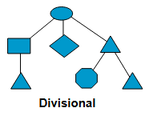
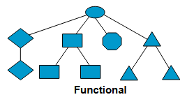
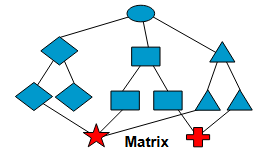
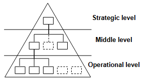
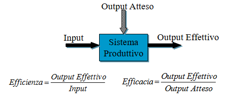
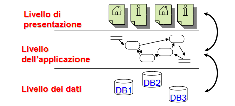
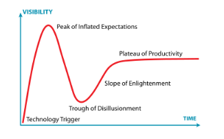
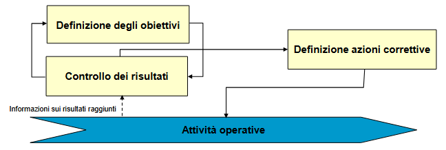
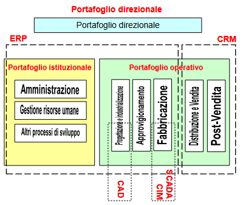
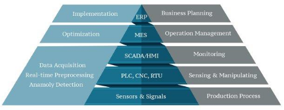

# Introduzione

## Comprendere le Aziende

Ogni **Impresa** o **Istituzione**, sia **Pubblica** sia **Privata**, si struttura e si organizza secondo la propria **Missione** e per conseguire gli obiettivi identificati.

- **Azienda Industriale Privata**: Ottenere **Utili** tramite la **produzione** e **vendita** di una ben definita **Classe di Prodotti** a una **Classe di Clienti**.

- **Azienda Pubblica di Servizi**: Erogare un **Insieme di Servizi** a una **Classe di
Utenti**, **massimizzando la Qualità del Servizio** e **minimizzandone il Costo**.

Per fare ciò l’impresa si struttura definendo una propria **Struttura Organizzativa** e un **Insieme di Processi Funzionali** che ne definiscono il comportamento.

## Struttura Organizzativa

La **Struttura Organizzativa** rappresenta la **suddivisione dell’impresa** in differenti **Unità Organizzative** alle quali sono attribuiti **compiti** ed **obiettivi** specifici e che cooperano attraverso **legami di tipo gerarchico e funzionale**.

I **Legami Gerarchici** nelle **Strutture Organizzative** vengono descritti tramite reticoli che delineano **Responsabilità** e **Funzioni**.

### Divisionale (Sector-based)

Le persone vengono raggruppate in base al **Prodotto** o **Servizio** che forniscono, non al lavoro che svolgono.

Ad esempio, una grande società come la General Electric ha divisioni per l'elettronica, i trasporti e l'aviazione, ognuna con il proprio team di contabili, esperti di marketing, ecc.

### Funzionale (Like-wise)

Raggruppa persone che svolgono **compiti simili** in base alla loro **area di specializzazione**.

In altre parole, troverai tutti i contabili in finanza e tutti i marketer nel marketing.

### A Matrice

È un **ibrido** delle **Strutture Funzionali** e **Divisionali**. Può coinvolgere **Dipendenti** che riferiscono a **Capi Diversi** a seconda del loro **Attuale Incarico**.

## Suddivisione delle Mansioni

- **Strategic** : Si concentra sulle **Attività** necessarie per garantire un posizionamento competitivo e una **strategia a lungo termine**.

- **Middle** : Implementa i **Piani Strategici** e garantire che le **Attività Quotidiane** siano conformi alla **Strategia Aziendale**.

- **Operational** : È legato alle **Operazioni a breve termine** di un'azienda, riguarda l'**implementazione di Beni e Servizi**.

## I Processi Aziendali

Un **Processo** è un **insieme delle Attività** tra loro **interconnesse**, finalizzate alla **realizzazione di un risultato definito**.

La **produzione di Prodotti** e **Servizi** richiede in genere il coinvolgimento di più **Unità Organizzative**, attraverso una **distribuzione di Compiti** e **Responsabilità**, spesso codificata in **Norme** che regolano il processo.

L’analisi dell’**Azienda come Insiemi di Processi** determina una vista ortogonale rispetto a quella basata sulla sua **Organizzazione** e sulle **Funzioni** svolte dalle diverse divisioni.

## Sistemi Informativi

I **Processi**, per poter operare, hanno bisogno di conoscere le risorse su cui agiscono, in altri termini **hanno bisogno di Informazioni**.

Si definisce ***Information Processing Capacity*** :
**“L'adeguatezza di un’organizzazione rispetto alle necessità di elaborare informazioni a essa imposte dai propri obiettivi e dal contesto in cui opera”**.

L’**insieme delle informazioni gestite, generate, utilizzate e elaborate** dai **Processi** aziendali e le **Modalità** per la loro gestione costituisce il **Sistema Informativo**.

## Sistemi Informatici

La porzione del **Sistema Informativo** in cui le **Informazioni** sono raccolte, elaborate, archiviate e scambiate mediante l’uso di **Tecnologie Informatiche** costituisce il **Sistema Informatico**.

## Efficacia ed efficienza

**Efficenza** = Misura il valore dell'output effettivo rispetto all'input
**Efficacia** = Aspettative vs Realtà

- L’**Innovazione Tecnologica** incide **positivamente** sull’**Efficienza Organizzativa** (Riduzione di costi e tempi di produzione).

- L’**Innovazione Tecnologica** incide **indirettamente** sull’**Efficacia Organizzativa** (Miglioramento pianificazione strategica e aumento competitività).

## Evoluzione dei Sistemi Informatici

#### Fase I
Automazione delle attività di **raccolta**, **archiviazione** e **reperimento** dei **Dati di natura Operativa** (es. stipendi, gestione ordini, fatturazione, ecc.).

Caratteristiche:
- **Ripetitività delle Operazioni** da controllare.
- **Natura strutturata dei Processi** da gestire.
- **Grandi quantità di Dati**.

Benefici:
- **Riduzione dei Tempi e dei Costi** di **elaborazione** delle **Informazione**.
- **Minore probabilità di errore**.

#### Fase II (Business Inteligence)

Automazione delle attività di **controllo** e **valutazione dell’andamento aziendale e delle scelte direzionali** (es. controllo della produzione, analisi what-if, gestione del budget, ecc.)

Caratteristiche:
- il **Sistema Informatico** assume un ruolo non solo passivo, ma anche di **controllo attivo** supportando i dirigenti e i quadri intermedi.

Benefici:
- **Riduzione dei Costi di Coordinamento e Controllo**.
- Possibilità di analisi impossibili se eseguite manualmente, rapidità.

#### Fase III
**Integrazione** tra le **Applicazioni Settoriali**.

Caratteristiche:
- I **Sistemi Informatici integrati** sono **orientati ai Dati**.
- **Assenza di Ridondanze e di Incoerenze**.
- Possibilità di **cooperare** e di **lavorare a distanza**.

Benefici:
- Aumento della **qualità dei Dati**.
- Globalizzazione dell’azienda.

## Sistemi Informativi VS Basi di Dati

I concetti di **Sistemi Informativo** e di **DB** non devono essere considerati dei sinonimi.

La definizione e la gestione di un **Sistemi Informativo** richiede la perfetta conoscenza dei **Processi Aziendali**, **Informazioni necessarie ai Processi** e la **Struttura Aziendale**.

Mentre per progettare un **Sistemi Informativi** richiede competenze in ambito di **Organizzazione Aziendale**, **Economia** e **Psicologia** (Convincere il cliente della fattibilità).

I **DB** sono quindi solo una **sottoporzione** del **Sistemi Informativo** atta alla **memorizzazione strutturata delle informazioni**, essendo queste il nucleo di tutti i **Sistemi Informativi** i **DB** rivestono un ruolo centrale. Dunque una **modellazione imprecisa** del **DB** implica lo **scorretto funzionamento** del **Sistemi Informativo**.

## Sistemi Informatici

La definizione del **Sistema Informatico** include anche la **modellazione della Logica Applicativa** legata alla realizzazione dei **Processi**, mentre la definizione di **DB** deve **prescindere quanto più possibile dalla Logica delle Applicazioni** e deve invece codificare la sola **realtà delle Informazioni**.

Inoltre, i moderni **Sistemi Informatici** sono strutturati su **tre livelli**, o ***three-tier***, che rispettano la seguente suddivisione.

## Digital Transformation

La **Digital Transformation** mira a migliorare l'**Efficienza** e l'**Efficacia** delle aziende sfruttando le possibilità offerte dalle nuove tecnologie.

Ma la **Digital Transformation** non è solo una **questione tecnologica**, richiede una **strategia a lungo termine**, un **percorso a piccoli passi** e ha bisogno di **cambiamenti nella mentalità delle persone** e nella **ricerca di talenti digitali**.

## Data Revolution

I **Dati** rappresentano il principale combustibile che alimenta la **Digital Transformation**.

I **Sistemi Informativi** non sono più limitati ai dati prodotti dai **processi aziendali**, ma vanno ripensati per permettere di **sfruttare tutti i dati utili** all’azienda e per poter supportare processi **Interni** ed **Esterni**.

## Big Data vs Small Data

La progressiva **digitalizzazione di Servizi e Impianti** genera una **enorme massa di dati eterogenei e in tempo reale**.

I ***Big Data*** devono essere trasformati in ***Small Data*** affinché possano essere sfruttati ai fini decisionali. Per gestire questa trasformazione occorrono
- **Tecnologia Ad Hoc** (NO SQL DBMS)
- **Potenza di Calcolo** (cluster computing)
- **Sistemi Automatizzati** (Intelligenza artificiale)

## Il ciclo di adozione delle tecnologie

L’adozione delle nuove tecnologie segue un **percorso standard** che prevede la **maturazione di una o più Tecnologie Abilitanti** e la loro **Diffusione**

La **prima fase** è guidata da **ricercatori** e **ingegneri**, mentre la **seconda** da **imprenditori**

## Hype Cycle

L’***Hype Cycle*** di **Gartner** modella questo percorso.

### Innovation Triggers

Gli **Innovation Trigger** sono soggetti innovativi che per primi riconoscono le potenzialità della tecnologia anche in assenza di prove della sua utilità.

### Peak of Inflated Expectations

Il ***Peak of Inflated Expectations*** rappresenta l'**attenzione dei media** unita ai **casi di successo**, spesso accompagnati da molte **adozioni fallite**, porta ad un'ampia **diffusione di casi d'uso**.

### Trough of Disillusions

Il ***Trough of disillusions*** rappresenta l’**adozione della tecnologia** anche **in contesti non idonei**, porta a un **aumento dei casi di fallimento**.

### Slope of Illumination

Lo ***Slope of Illumination*** è un ampio **spettro di applicazioni** che consente di **identificare i campi di applicazione** in cui la **tecnologia è efficace** e di **far evolvere la tecnologia stessa** in modo che possa adattarsi ai **contesti in cui è effettivamente utile**.

### Plateau of Productivity

Il ***Plateau of Productivity*** copre il periodo fino a quando il prodotto non **diventa maturo**, **affidabile** e **ampiamente utilizzato**.

---

# Classificazione dei Sistemi Informativi

## Catena di Valore di Porter

Da Approfondire

## Sistemi Informativi Operativi

Sono **Sistemi Informativi** che **Informatizzano Processi** volti all’**esecuzione di Attività** o alla loro **programmazione**, ovvero automatizzano le attività quotidiane e i processi aziendali di base.

L’importanza dei **SI Operativi** in una azienda dipende dall’**Intensità Informativa del Settore** ossia del **Contenuto Informativo del Settore**.

## Sistemi Informativi Direzionali

Supportano il **Processo Decisionale** fornendo informazioni ai **Manager** per aiutarli a prender decisioni.

Il modello primario di questi sistemi deriva dal modello del **Ciclo di Controllo**:

I **Processi Direzionali** si differenziano da quelli **Operativi** poiché:

- Si basano su **Indici**, ovvero **informazioni aggregate** e **riassuntive**.
- L’elaborazione non è continua ma **periodica**.
- Sono costruiti sopra i **SI Operativi** da cui estraggono le **Informazioni di Base**.

## Sistemi Informativi Analitici

Supportano la **comprensione dei Fenomeni di Business** e sono focalizzati su **Prodotti**, **Clienti** e **Processi**.

Permettono di **profilare i Clienti** studiando le relative **abitudini** e **comportamenti**, mantengono la **Storia del Prodotto** e permettono di **monitorarne l’Affidabilità**.

Mentre i **Sistemi Direzionali** valutano **fenomeni interni all’azienda**, quelli **Analitici** misurano **fenomeni esterni all’azienda**.

## La Mappa dei Sistemi Informativi Aziendali

Costruire una **Mappa dei Sistemi Informativi Aziendali**, significa scomporli in **Moduli** a fini **Conoscitivi** e di **Classificazione**.

Un **Modulo** rappresenta un **Blocco di Funzionalità Software** che supportano una **Fase** di un **Processo Aziendale**, omogeneo per frequenza, attore e profilo di casi d’uso.

Un **Modulo** descrive un’**Esigenza Informativa** e quindi indica il **potenziale impiego di Tecnologia Informatica**.

I **Moduli** possono essere:
- **Orizzontali**: Non variano al variare della tipologia aziendale.
- **Verticali**: Sono utilizzati in **specifici Settori Produttivi**.

## Portafoglio Applicativo Aziendale

Mappa di esigenze informative dell'azienda, il portafoglio applicativo comprende le applicazioni utilizzate dai processi primari specificati dalla catena del valore.

Rappresenta una possibile **Mappa dei Sistemi Informativi Aziendali** e può essere considerato un’esplosione della **Catena del Valore di Porter** ottenuta incrociando le **Fasi del Ciclo di Trasformazione** con la **Tipologia delle Attività Applicabili** per la pianificazione ed esecuzione di ciascuna fase del ciclo, dove **ogni Incrocio individua un Modulo**.

Le attività di pianificazione si distinguono per l’orizzonte temporale e il livello di dettaglio.

Le attività di esecuzione attuano le operazioni pianificate producendo così l’output desiderato. I sistemi di supporto all’esecuzione elaborano informazioni in tempo reale originando benefici riconducibili ai risparmi su attività burocratiche o alle migliori prestazioni di tempi e costi dei processi.

---

Portafoglio Operativo = Insieme dei processi legati alla realizzazione del prodotto o servizio

Portafoglio Istituzionale = Inseme dei processi Amministrativi per la gestione aziendale

ERP = Enterprise Resource Planning
CRM = Customer Relationship Management

CIM = Computer Integrated Manufacturing
CAD = Computer Aided Design

## Smart Manufacturing o CIM

Un'**Architettura Multilivello** che collega diversi livelli di un **Sistema di Produzione** ed è finalizzata all'**ottimizzazione dei processi** e alla **gestione delle risorse**.

CIM pro:
- Riduzione delle scorte in stock
- Riduzione del tempo di commercializzazione
- Aumento della qualità del prodotto
- Riduzione dei costi grazie alla maggiore efficienza della fabbrica

## SCADA

Il **sistema SCADA** (o ***Supervisory Control and Data Acquisition***) è la componente di un **sistema CIM** preposto al **controllo dei sistemi industriali, all’acquisizione e all’analisi dei dati da essi prodotti**.

I **sistemi SCADA** sono usati per **monitorare e controllare grandi impianti industriali e sistemi meccanici/elettronici distribuiti sul territorio**.

L’adozione di un sistema SCADA permette di risparmiare tempo e denaro:
- Meno spostamenti per i lavoratori
- Riduzione delle esigenze di personale
- Aumento della produttività
- Maggiore reattività rispetto a situazioni anomale
- Riduzione dei costi di gestione
- Maggiore affidabilità degli impianti

## Architettura dei sistemi SCADA

- **Sensori** e **Attuatori**
- **Controllori** :
    -**PLC** o ***Programmable Logic Controller***: è un qualunque **dispositivo programmabile** in grado di risolvere una logica che implementa un algoritmo.
    - **RTU** o ***Remote Terminal Unit***: non elabora né risolve alcuna logica, è una unità terminale che ricevuti gli "ordini" da una unità di classe superiore non fa altro che eseguirli (Si tratta quindi di un ripetitore con capacità di comunicazione).
- **Gateway** : Raccolgono le informazioni dai PLC/RTU e si occupano di trasferirle in tempo reale al sistema centralizzato implementando opportuni protocolli di trasmissione, crittografia, sicurezza.
- **Front-end Server** : Ricevono i dati dai diversi siti e li traducono in un formato utilizzabile dal **Server Scada**. Sono logicamente separati da quest’ultimo a garanzia di un tempo di acquisizione in real-time
- **Scada Server**: implementano le funzionalità di monitoraggio e di gestione degli allarmi. Operano in tempo reale tipicamente utilizzando uno stream dati. Utilizza un database contenente una serie limitata di dati di dettaglio. Può supportare il controllo automatico tramite interfacce grafiche disposte in una control room, oppure può implementare regole di alerting automatiche.
-  **Data Server** : Si occupa di salvare una versione storica dei dati, è la base dati utilizzata a fini di analisi.

## Internet of Things

Indica le **connessioni digitali** tra gli **oggetti** (le "cose") che si rendono **riconoscibili** e **acquisiscono intelligenza** grazie al fatto di poter **comunicare dati su se stessi** e **accedere ad informazioni aggregate** da parte di altri.

Scada vs IOT, nell'IOT la comunicazione è bidirezionale e non monodirezionale, gli agenti sono elementi attivi nella rete e effettuano del reasoning interno.

## Sistemi MES o Manufacturing Execution Systems

I **MES** permettono la **gestione della fabbrica nel suo complesso**, ricevono ordini dall'**ERP**, **raccolgono informazioni** dallo **SCADA** e **forniscono informazioni aggiornate** all'**ERP**.

## Sistemi ERP o Enterprise Resource Planning

Il termine **ERP** è stato coniato agli inizi degli anni ’90 da **Gartner Group** per indicare una suite di moduli applicativi che **supportano l’intera gamma dei processi aziendali**.

***Il vantaggio dell’integrazione sta nella circolarità dell’informazione***.

La suite ERP rispecchia una precisa concezione del sistema informativo che si basa sulle seguenti caratteristiche distintive:
- Unicità dell’informazione
- Estensione e modularità funzionale
- Prescrittività

## Il paradigma ERP: unicità dell’informazione

Tutte le elaborazioni condividono uno e un solo valore per ogni informazione

L’unicità dell’informazione è ottenuta utilizzando un’unica base di dati condivisa che offre i seguenti vantaggi:
- La **Sincronizzazione dei Dati**, che permette la **Sincronizzazione dei Processi Interdipendenti**.
- **Assenza di Ridondanza**, non sono più necessarie complesse procedure di aggiornamento dei dati presenti nelle diverse isole aziendali.
- **Tracciabilità degli Aggiornamenti**, è sempre possibili individuare perché e chi ha
modificato un certo valore.
- **Affidabilità dell’Informazione Aziendale**, provenendo da un’**unica sorgente**, non si rischia che i **Dati Direzionali** siano **Inconsistenti** perdendo di conseguenza di credibilità.

## Il paradigma ERP: estensione e modularità
L’ampiezza della copertura dei **Sistemi ERP** fa si che questi possano essere utilizzati come **unica soluzione** per il **Sistema Informativo**.

La **Modularità** del sistema permette all’azienda di scegliere solo i **moduli di interesse**.

Le strategie adottabili sono le seguenti:
- **Incrementale**: Si **acquistano progressivamente** i moduli che nella precedente configurazione del **Sistema Informativo** mancavano o erano realizzati mediante **Sistemi Legacy inadeguati**.
- **One Stop shopping**: Si predilige la linearità **acquistando i moduli di un solo vendor**, possibilmente in un’unica tranche.
- **Best of Breed**: Vengono utilizzati i **moduli di diversi vendor che meglio si prestano alle esigenze dell’azienda** o che vengono **considerati i migliori**.

## Il paradigma ERP: prescrittività

**E’ necessario far aderire i processi aziendali a quelli definiti nell’ERP**.

L’approccio a un progetto ERP è invertito rispetto a quanto avviene nella progettazione di un Sistema Informativo “su misura”.

L’impatto organizzativo può essere elevato, tuttavia, i **Processi ERP** sono basati sulle **Best Practices del Settore**, garantiscono la **correttezza** e **standardizzazione** delle **Operazioni** e infine favorisce la **razionalizzazione dei Processi**, facendo coincidere il **Progetto Informatico ERP** con un **Progetto di BPR** (***Business Process Reengineering***)

I **Sistemi ERP** non devono tuttavia considerarsi oggetti immutabili, esistono ampi margini di personalizzazione, necessari a gestire il gap tra il modulo standard e le specificità delle aziende.

La figura del **Programmatore** è sostituita da quella del **Parametrizzatore**, che **non scrive il software, ma agisce, con strumentazioni per accordarlo secondo le esigenze dell’impresa**.

## Sistemi ERP allargati

**PLM** o **Product Lifecycle Management**: di supporto alla **gestione della
Documentazione Tecnica del Prodotto** e dei relativi **Processi Produttivi**.

**SCM** o **Supply Chain Management**: di supporto alla **Pianificazione** e al **Controllo** delle **Attività Interaziendali**.

**CRM** o **Customer Relationship Management**: supporto all’**Interazione con il Cliente**.

**E-procurement**: permettono la **realizzazione di Mercati Elettronici Interaziendali** in cui le condizioni quadro e i fornitori sono definite dagli uffici acquisti, mentre sono i reparti utenti a seguire gli acquisti veri e propri abbattendo così costi e tempi.

