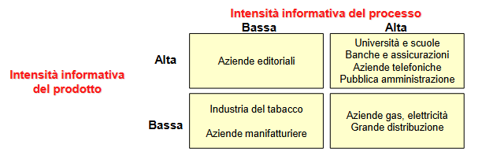

# Introduzione

## Comprendere le Aziende

Ogni **Impresa** o **Istituzione**, sia **Pubblica** sia **Privata**, si struttura e si organizza secondo la propria **Missione** e per conseguire gli obiettivi identificati.

- **Azienda Industriale Privata**: Ottenere **Utili** tramite la **produzione** e **vendita** di una ben definita **Classe di Prodotti** a una **Classe di Clienti**.

- **Azienda Pubblica di Servizi**: Erogare un **Insieme di Servizi** a una **Classe di
Utenti**, **massimizzando la Qualità del Servizio** e **minimizzandone il Costo**.

Per fare ciò l’impresa si struttura definendo una propria **Struttura Organizzativa** e un **Insieme di Processi Funzionali** che ne definiscono il comportamento.

## Struttura Organizzativa

La **Struttura Organizzativa** rappresenta la **suddivisione dell’impresa** in differenti **Unità Organizzative** alle quali sono attribuiti **compiti** ed **obiettivi** specifici e che cooperano attraverso **legami di tipo gerarchico e funzionale**.

I **Legami Gerarchici** nelle **Strutture Organizzative** vengono descritti tramite reticoli che delineano **Responsabilità** e **Funzioni**.

### Divisionale (Sector-based)

Le persone vengono raggruppate in base al **Prodotto** o **Servizio** che forniscono, non al lavoro che svolgono.

Ad esempio, una grande società come la General Electric ha divisioni per l'elettronica, i trasporti e l'aviazione, ognuna con il proprio team di contabili, esperti di marketing, ecc.

### Funzionale (Like-wise)

Raggruppa persone che svolgono **compiti simili** in base alla loro **area di specializzazione**.

In altre parole, troverai tutti i contabili in finanza e tutti i marketer nel marketing.

### A Matrice

È un **ibrido** delle **Strutture Funzionali** e **Divisionali**. Può coinvolgere **Dipendenti** che riferiscono a **Capi Diversi** a seconda del loro **Attuale Incarico**.

## Suddivisione delle Mansioni

- **Strategic** : Si concentra sulle **Attività** necessarie per garantire un posizionamento competitivo e una **strategia a lungo termine**.

- **Middle** : Implementa i **Piani Strategici** e garantire che le **Attività Quotidiane** siano conformi alla **Strategia Aziendale**.

- **Operational** : È legato alle **Operazioni a breve termine** di un'azienda, riguarda l'**implementazione di Beni e Servizi**.

## I Processi Aziendali

Un **Processo** è un **insieme delle Attività** tra loro **interconnesse**, finalizzate alla **realizzazione di un risultato definito**.

La **produzione di Prodotti** e **Servizi** richiede in genere il coinvolgimento di più **Unità Organizzative**, attraverso una **distribuzione di Compiti** e **Responsabilità**, spesso codificata in **Norme** che regolano il processo.

L’analisi dell’**Azienda come Insiemi di Processi** determina una vista ortogonale rispetto a quella basata sulla sua **Organizzazione** e sulle **Funzioni** svolte dalle diverse divisioni.

## Sistemi Informativi

I **Processi**, per poter operare, hanno bisogno di conoscere le risorse su cui agiscono, in altri termini **hanno bisogno di Informazioni**.

Si definisce ***Information Processing Capacity*** :
**“L'adeguatezza di un’organizzazione rispetto alle necessità di elaborare informazioni a essa imposte dai propri obiettivi e dal contesto in cui opera”**.

L’**insieme delle informazioni gestite, generate, utilizzate e elaborate** dai **Processi** aziendali e le **Modalità** per la loro gestione costituisce il **Sistema Informativo**.

## Sistemi Informatici

La porzione del **Sistema Informativo** in cui le **Informazioni** sono raccolte, elaborate, archiviate e scambiate mediante l’uso di **Tecnologie Informatiche** costituisce il **Sistema Informatico**.

## Efficacia ed efficienza

**Efficenza** = Misura il valore dell'output effettivo rispetto all'input
**Efficacia** = Aspettative vs Realtà

- L’**Innovazione Tecnologica** incide **positivamente** sull’**Efficienza Organizzativa** (Riduzione di costi e tempi di produzione).

- L’**Innovazione Tecnologica** incide **indirettamente** sull’**Efficacia Organizzativa** (Miglioramento pianificazione strategica e aumento competitività).

## Evoluzione dei Sistemi Informatici

#### Fase I
Automazione delle attività di **raccolta**, **archiviazione** e **reperimento** dei **Dati di natura Operativa** (es. stipendi, gestione ordini, fatturazione, ecc.).

Caratteristiche:
- **Ripetitività delle Operazioni** da controllare.
- **Natura strutturata dei Processi** da gestire.
- **Grandi quantità di Dati**.

Benefici:
- **Riduzione dei Tempi e dei Costi** di **elaborazione** delle **Informazione**.
- **Minore probabilità di errore**.

#### Fase II (Business Inteligence)

Automazione delle attività di **controllo** e **valutazione dell’andamento aziendale e delle scelte direzionali** (es. controllo della produzione, analisi what-if, gestione del budget, ecc.)

Caratteristiche:
- il **Sistema Informatico** assume un ruolo non solo passivo, ma anche di **controllo attivo** supportando i dirigenti e i quadri intermedi.

Benefici:
- **Riduzione dei Costi di Coordinamento e Controllo**.
- Possibilità di analisi impossibili se eseguite manualmente, rapidità.

#### Fase III
**Integrazione** tra le **Applicazioni Settoriali**.

Caratteristiche:
- I **Sistemi Informatici integrati** sono **orientati ai Dati**.
- **Assenza di Ridondanze e di Incoerenze**.
- Possibilità di **cooperare** e di **lavorare a distanza**.

Benefici:
- Aumento della **qualità dei Dati**.
- Globalizzazione dell’azienda.

## Sistemi Informativi VS Basi di Dati

I concetti di **Sistemi Informativo** e di **DB** non devono essere considerati dei sinonimi.

La definizione e la gestione di un **Sistemi Informativo** richiede la perfetta conoscenza dei **Processi Aziendali**, **Informazioni necessarie ai Processi** e la **Struttura Aziendale**.

Mentre per progettare un **Sistemi Informativi** richiede competenze in ambito di **Organizzazione Aziendale**, **Economia** e **Psicologia** (Convincere il cliente della fattibilità).

I **DB** sono quindi solo una **sottoporzione** del **Sistemi Informativo** atta alla **memorizzazione strutturata delle informazioni**, essendo queste il nucleo di tutti i **Sistemi Informativi** i **DB** rivestono un ruolo centrale. Dunque una **modellazione imprecisa** del **DB** implica lo **scorretto funzionamento** del **Sistemi Informativo**.

## Sistemi Informatici

La definizione del **Sistema Informatico** include anche la **modellazione della Logica Applicativa** legata alla realizzazione dei **Processi**, mentre la definizione di **DB** deve **prescindere quanto più possibile dalla Logica delle Applicazioni** e deve invece codificare la sola **realtà delle Informazioni**.

Inoltre, i moderni **Sistemi Informatici** sono strutturati su **tre livelli**, o ***three-tier***, che rispettano la seguente suddivisione.

## Digital Transformation

La **Digital Transformation** mira a migliorare l'**Efficienza** e l'**Efficacia** delle aziende sfruttando le possibilità offerte dalle nuove tecnologie.

Ma la **Digital Transformation** non è solo una **questione tecnologica**, richiede una **strategia a lungo termine**, un **percorso a piccoli passi** e ha bisogno di **cambiamenti nella mentalità delle persone** e nella **ricerca di talenti digitali**.

## Data Revolution

I **Dati** rappresentano il principale combustibile che alimenta la **Digital Transformation**.

I **Sistemi Informativi** non sono più limitati ai dati prodotti dai **processi aziendali**, ma vanno ripensati per permettere di **sfruttare tutti i dati utili** all’azienda e per poter supportare processi **Interni** ed **Esterni**.

## Big Data vs Small Data

La progressiva **digitalizzazione di Servizi e Impianti** genera una **enorme massa di dati eterogenei e in tempo reale**.

I ***Big Data*** devono essere trasformati in ***Small Data*** affinché possano essere sfruttati ai fini decisionali. Per gestire questa trasformazione occorrono
- **Tecnologia Ad Hoc** (NO SQL DBMS)
- **Potenza di Calcolo** (cluster computing)
- **Sistemi Automatizzati** (Intelligenza artificiale)

## Il ciclo di adozione delle tecnologie

L’adozione delle nuove tecnologie segue un **percorso standard** che prevede la **maturazione di una o più Tecnologie Abilitanti** e la loro **Diffusione**

La **prima fase** è guidata da **ricercatori** e **ingegneri**, mentre la **seconda** da **imprenditori**

## Hype Cycle

L’***Hype Cycle*** di **Gartner** modella questo percorso.

### Innovation Triggers

Gli **Innovation Trigger** sono soggetti innovativi che per primi riconoscono le potenzialità della tecnologia anche in assenza di prove della sua utilità.

### Peak of Inflated Expectations

Il ***Peak of Inflated Expectations*** rappresenta l'**attenzione dei media** unita ai **casi di successo**, spesso accompagnati da molte **adozioni fallite**, porta ad un'ampia **diffusione di casi d'uso**.

### Trough of Disillusions

Il ***Trough of disillusions*** rappresenta l’**adozione della tecnologia** anche **in contesti non idonei**, porta a un **aumento dei casi di fallimento**.

### Slope of Illumination

Lo ***Slope of Illumination*** è un ampio **spettro di applicazioni** che consente di **identificare i campi di applicazione** in cui la **tecnologia è efficace** e di **far evolvere la tecnologia stessa** in modo che possa adattarsi ai **contesti in cui è effettivamente utile**.

### Plateau of Productivity

Il ***Plateau of Productivity*** copre il periodo fino a quando il prodotto non **diventa maturo**, **affidabile** e **ampiamente utilizzato**.

---

# Classificazione dei Sistemi Informativi

## Catena di Valore di Porter

Da Approfondire

## Sistemi Informativi Operativi

Sono **Sistemi Informativi** che **Informatizzano Processi** volti all’**esecuzione di Attività** o alla loro **programmazione**, ovvero automatizzano le attività quotidiane e i processi aziendali di base.

L’importanza dei **SI Operativi** in una azienda dipende dall’**Intensità Informativa del Settore** ossia del **Contenuto Informativo del Settore**.

## Sistemi Informativi Direzionali

Supportano il **Processo Decisionale** fornendo informazioni ai **Manager** per aiutarli a prender decisioni.

Il modello primario di questi sistemi deriva dal modello del **Ciclo di Controllo**:

I **Processi Direzionali** si differenziano da quelli **Operativi** poiché:

- Si basano su **Indici**, ovvero **informazioni aggregate** e **riassuntive**.
- L’elaborazione non è continua ma **periodica**.
- Sono costruiti sopra i **SI Operativi** da cui estraggono le **Informazioni di Base**.

## Sistemi Informativi Analitici

Supportano la **comprensione dei Fenomeni di Business** e sono focalizzati su **Prodotti**, **Clienti** e **Processi**.

Permettono di **profilare i Clienti** studiando le relative **abitudini** e **comportamenti**, mantengono la **Storia del Prodotto** e permettono di **monitorarne l’Affidabilità**.

Mentre i **Sistemi Direzionali** valutano **fenomeni interni all’azienda**, quelli **Analitici** misurano **fenomeni esterni all’azienda**.

## La Mappa dei Sistemi Informativi Aziendali

Costruire una **Mappa dei Sistemi Informativi Aziendali**, significa scomporli in **Moduli** a fini **Conoscitivi** e di **Classificazione**.

Un **Modulo** rappresenta un **Blocco di Funzionalità Software** che supportano una **Fase** di un **Processo Aziendale**, omogeneo per frequenza, attore e profilo di casi d’uso.

Un **Modulo** descrive un’**Esigenza Informativa** e quindi indica il **potenziale impiego di Tecnologia Informatica**.

I **Moduli** possono essere:
- **Orizzontali**: Non variano al variare della tipologia aziendale.
- **Verticali**: Sono utilizzati in **specifici Settori Produttivi**.

## Portafoglio Applicativo Aziendale

Mappa di esigenze informative dell'azienda, il portafoglio applicativo comprende le applicazioni utilizzate dai processi primari specificati dalla catena del valore.

Rappresenta una possibile **Mappa dei Sistemi Informativi Aziendali** e può essere considerato un’esplosione della **Catena del Valore di Porter** ottenuta incrociando le **Fasi del Ciclo di Trasformazione** con la **Tipologia delle Attività Applicabili** per la pianificazione ed esecuzione di ciascuna fase del ciclo, dove **ogni Incrocio individua un Modulo**.

Le attività di pianificazione si distinguono per l’orizzonte temporale e il livello di dettaglio.

Le attività di esecuzione attuano le operazioni pianificate producendo così l’output desiderato. I sistemi di supporto all’esecuzione elaborano informazioni in tempo reale originando benefici riconducibili ai risparmi su attività burocratiche o alle migliori prestazioni di tempi e costi dei processi.

---

Portafoglio Operativo = Insieme dei processi legati alla realizzazione del prodotto o servizio

Portafoglio Istituzionale = Inseme dei processi Amministrativi per la gestione aziendale

ERP = Enterprise Resource Planning
CRM = Customer Relationship Management

CIM = Computer Integrated Manufacturing
CAD = Computer Aided Design

## Smart Manufacturing o CIM

Un'**Architettura Multilivello** che collega diversi livelli di un **Sistema di Produzione** ed è finalizzata all'**ottimizzazione dei processi** e alla **gestione delle risorse**.

CIM pro:
- Riduzione delle scorte in stock
- Riduzione del tempo di commercializzazione
- Aumento della qualità del prodotto
- Riduzione dei costi grazie alla maggiore efficienza della fabbrica

## SCADA

Il **sistema SCADA** (o ***Supervisory Control and Data Acquisition***) è la componente di un **sistema CIM** preposto al **controllo dei sistemi industriali, all’acquisizione e all’analisi dei dati da essi prodotti**.

I **sistemi SCADA** sono usati per **monitorare e controllare grandi impianti industriali e sistemi meccanici/elettronici distribuiti sul territorio**.

L’adozione di un sistema SCADA permette di risparmiare tempo e denaro:
- Meno spostamenti per i lavoratori
- Riduzione delle esigenze di personale
- Aumento della produttività
- Maggiore reattività rispetto a situazioni anomale
- Riduzione dei costi di gestione
- Maggiore affidabilità degli impianti

## Architettura dei sistemi SCADA

- **Sensori** e **Attuatori**
- **Controllori** :
    -**PLC** o ***Programmable Logic Controller***: è un qualunque **dispositivo programmabile** in grado di risolvere una logica che implementa un algoritmo.
    - **RTU** o ***Remote Terminal Unit***: non elabora né risolve alcuna logica, è una unità terminale che ricevuti gli "ordini" da una unità di classe superiore non fa altro che eseguirli (Si tratta quindi di un ripetitore con capacità di comunicazione).
- **Gateway** : Raccolgono le informazioni dai PLC/RTU e si occupano di trasferirle in tempo reale al sistema centralizzato implementando opportuni protocolli di trasmissione, crittografia, sicurezza.
- **Front-end Server** : Ricevono i dati dai diversi siti e li traducono in un formato utilizzabile dal **Server Scada**. Sono logicamente separati da quest’ultimo a garanzia di un tempo di acquisizione in real-time
- **Scada Server**: implementano le funzionalità di monitoraggio e di gestione degli allarmi. Operano in tempo reale tipicamente utilizzando uno stream dati. Utilizza un database contenente una serie limitata di dati di dettaglio. Può supportare il controllo automatico tramite interfacce grafiche disposte in una control room, oppure può implementare regole di alerting automatiche.
-  **Data Server** : Si occupa di salvare una versione storica dei dati, è la base dati utilizzata a fini di analisi.

## Internet of Things

Indica le **connessioni digitali** tra gli **oggetti** (le "cose") che si rendono **riconoscibili** e **acquisiscono intelligenza** grazie al fatto di poter **comunicare dati su se stessi** e **accedere ad informazioni aggregate** da parte di altri.

Scada vs IOT, nell'IOT la comunicazione è bidirezionale e non monodirezionale, gli agenti sono elementi attivi nella rete e effettuano del reasoning interno.

## Sistemi MES o Manufacturing Execution Systems

I **MES** permettono la **gestione della fabbrica nel suo complesso**, ricevono ordini dall'**ERP**, **raccolgono informazioni** dallo **SCADA** e **forniscono informazioni aggiornate** all'**ERP**.

## Sistemi ERP o Enterprise Resource Planning

Il termine **ERP** è stato coniato agli inizi degli anni ’90 da **Gartner Group** per indicare una suite di moduli applicativi che **supportano l’intera gamma dei processi aziendali**.

***Il vantaggio dell’integrazione sta nella circolarità dell’informazione***.

La suite ERP rispecchia una precisa concezione del sistema informativo che si basa sulle seguenti caratteristiche distintive:
- Unicità dell’informazione
- Estensione e modularità funzionale
- Prescrittività

## Il paradigma ERP: unicità dell’informazione

Tutte le elaborazioni condividono uno e un solo valore per ogni informazione

L’unicità dell’informazione è ottenuta utilizzando un’unica base di dati condivisa che offre i seguenti vantaggi:
- La **Sincronizzazione dei Dati**, che permette la **Sincronizzazione dei Processi Interdipendenti**.
- **Assenza di Ridondanza**, non sono più necessarie complesse procedure di aggiornamento dei dati presenti nelle diverse isole aziendali.
- **Tracciabilità degli Aggiornamenti**, è sempre possibili individuare perché e chi ha
modificato un certo valore.
- **Affidabilità dell’Informazione Aziendale**, provenendo da un’**unica sorgente**, non si rischia che i **Dati Direzionali** siano **Inconsistenti** perdendo di conseguenza di credibilità.

## Il paradigma ERP: estensione e modularità
L’ampiezza della copertura dei **Sistemi ERP** fa si che questi possano essere utilizzati come **unica soluzione** per il **Sistema Informativo**.

La **Modularità** del sistema permette all’azienda di scegliere solo i **moduli di interesse**.

Le strategie adottabili sono le seguenti:
- **Incrementale**: Si **acquistano progressivamente** i moduli che nella precedente configurazione del **Sistema Informativo** mancavano o erano realizzati mediante **Sistemi Legacy inadeguati**.
- **One Stop shopping**: Si predilige la linearità **acquistando i moduli di un solo vendor**, possibilmente in un’unica tranche.
- **Best of Breed**: Vengono utilizzati i **moduli di diversi vendor che meglio si prestano alle esigenze dell’azienda** o che vengono **considerati i migliori**.

## Il paradigma ERP: prescrittività

**E’ necessario far aderire i processi aziendali a quelli definiti nell’ERP**.

L’approccio a un progetto ERP è invertito rispetto a quanto avviene nella progettazione di un Sistema Informativo “su misura”.

L’impatto organizzativo può essere elevato, tuttavia, i **Processi ERP** sono basati sulle **Best Practices del Settore**, garantiscono la **correttezza** e **standardizzazione** delle **Operazioni** e infine favorisce la **razionalizzazione dei Processi**, facendo coincidere il **Progetto Informatico ERP** con un **Progetto di BPR** (***Business Process Reengineering***)

I **Sistemi ERP** non devono tuttavia considerarsi oggetti immutabili, esistono ampi margini di personalizzazione, necessari a gestire il gap tra il modulo standard e le specificità delle aziende.

La figura del **Programmatore** è sostituita da quella del **Parametrizzatore**, che **non scrive il software, ma agisce, con strumentazioni per accordarlo secondo le esigenze dell’impresa**.

## Sistemi ERP allargati

**PLM** o **Product Lifecycle Management**: di supporto alla **gestione della
Documentazione Tecnica del Prodotto** e dei relativi **Processi Produttivi**.

**SCM** o **Supply Chain Management**: di supporto alla **Pianificazione** e al **Controllo** delle **Attività Interaziendali**.

**CRM** o **Customer Relationship Management**: supporto all’**Interazione con il Cliente**.

**E-procurement**: permettono la **realizzazione di Mercati Elettronici Interaziendali** in cui le condizioni quadro e i fornitori sono definite dagli uffici acquisti, mentre sono i reparti utenti a seguire gli acquisti veri e propri abbattendo così costi e tempi.

## CRM

Il termine **CRM** (***Customer Relationship Management***) indica il **processo integrato** e **strutturato** per la **gestione della relazione con la clientela**, il cui scopo è **costruire relazioni personalizzate** di lungo periodo, capaci di **aumentare la soddisfazione del cliente** e di **aumentare il valore dell’impresa** per il **Cliente**.

Il **Cliente** diventa il **focus centrale della strategia commerciale**.

Il ruolo dei **Sistemi CRM** varia a secondo dei settori di attività ed è massimo nelle aziende con **relazioni frequenti e continuate nel tempo** con una clientela numerosa, geograficamente distribuita, che interagisce attraverso diversi canali.

Esistono tre **Moduli principali** in un **Sistema CRM**:
- **CRM Operativo**: Informatizza i **Canali** attraverso cui avvengono i **contatti con il cliente**
- **CRM Analitico**: Informatizza l’**Analisi della Clientela** al fine di definire le **Politiche di Promozione e di Contatto**.
- **CRM Direzionale**: Permette al **Management** di **valutare la Performance dell’Azienda** verso il cliente.

Il **CRM Analitico** supporta il **Settore Commerciale e Marketing** nella **pianificazione** delle proprie **attività**, mentre il **CRM Direzionale** supporta la **Dirigenza** nel valutare l’**Efficienza del Settore Marketing e Commerciale**.

## Il Paradigma CRM

Le caratteristiche che denotano un sistema CRM possono essere così riassunte:
- **Multicanalità**: Il **cliente** sceglie di volta in volta il **Canale di Contatto più conveniente** ed il **Servizio** deve essere **erogabile 24h**.
- **Completezza e Unicità dei Dati** su prodotti e clienti: Per rendere possibile la **Multicanalità** le **Informazioni sul Cliente** devono essere **condivise dai diversi Sistemi di Contatto** che utilizzeranno una **DB comune**.
- **Catene di Servizio**: Le **richieste** sottoposte ai **Front-End** generano una serie di **Attività** complesse sui sistemi di **Back-End**.

L’**Efficienza del Sistema CRM** dipende quindi dalla **capacità di integrare i Servizi del SI**.

## I Canali CRM: Presenza

Il **CRM** dà **supporto al Venditore** nel ciclo di **individuazione del Cliente**, di **Contatto**, di **Trattativa** e di **Ordinazione** vera e propria.

Dato che l’**Automazione è indirizzata al Venditore** si parla di applicazioni ***Sales Force Automation*** (**SFA**).

## I Canali CRM: Voce e corrispondenza

Il **Cliente** interagisce via telefono con una **Rete di Operatori** assistiti dal **Sistema CRM**, e di **Sistemi Automatici Integrati** con gli apparati telefonici (**Call-Center**).

La **Componente Informatica**:
- Permette di **smistare le chiamate** in base al **Servizio richiesto**.
- Fornisce **Risposte** e **Servizi** in maniera **Automatica** e con modalità **Self-Service**.
- Rende **trasparente la Multilocalizzazione** dei **Call-Center**.
- Supporta gli **Operatori**.

Nel **Canale Corrispondenza** il **Cliente** interagisce via **e-mail** con l’**Azienda** in cui gli **Operatori** smistano le lettere in entrata.

L’azienda può inoltre utilizzare **Sistemi Automatici** di invio rendendo possibili **Campagne di Marketing** o **Servizi Informazioni** altrimenti irrealizzabili.

## I Canali CRM: Web

Il **Canale web** (detto di **Commercio Elettronico**) è diventato il **principale Canale CRM**:
- Vendita self-service 24 ore su 24.
- Possibilità di personalizzazione per singolo utente.
- Evidenza al cliente dello stato degli ordini.
- Registrazione del percorso di navigazione del cliente (click stream analysis).

I **Servizi Web** si classificano in:
- ***Business-to-Customer*** (**B2C**): **Punti di Accesso** per gli **Utenti Finali** fortemente orientati all’**acquisto**.
- ***Business-to-Business*** (**B2B**): **Punti di Accesso** per le **Aziende Partner** maggiormente orientati ai **Servizi**.

---

# Pianificazione dei SI

## Legge di Martec

Nella maggior parte dei **Processi Innovativi** sono le **Persone** e i **Processi** a **frenare l’Innovazione** a causa dell’**avversione all’Innovazione** e alla **legge di Martec**

Questo fenomeno può determinare un **senso di Inadeguatezza** con conseguente **avversione all’Innovazione Tecnologica**.

Questo richiede alle **Aziende** di:
- **Prioritizzare le innovazioni** da adottare.
- Diventare più **agili** e **abituarsi al cambiamento** continuo.
- Adottare **Cambiamenti Rivoluzionari**, come la **Revisione di Sistemi, processi o strutture** per allinearsi alla **curva esponenziale dei progressi tecnologici**.

## La Law of Accelerating Returns di Ray Kurzweil (2001)

Un **Concetto** per descrivere come il **Progresso Tecnologico** tenda ad **accelerare in modo Esponenziale**, anziché lineare, nel tempo.

Questo accade perché ogni **Innovazione Tecnologica** fornisce gli strumenti per **sviluppare ulteriori innovazioni** a un ritmo sempre più rapido.

## l ciclo di Deming

Sintetizza la **Logica** secondo la quale **gestire il Ciclo di Innovazione**.

Il termine “**Ciclo**” vuole enfatizzare la **ripetitività delle Fasi** che si devono **continuamente ripetere durante tutta la vita dell’Azienda**.

L’adozione di un **Ciclo di Pianificazione e Controllo** è il primo passo per mantenere attuale il **Sistema Informativo** minimizzando i **rischi di Incoerenza** e i **Costi di Realizzazione**.

## Pianificazione

Nella **Fase di Pianificazione** si collocano:

- La **Formalizzazione delle Strategie** in termini di **Servizio** e di **utilizzo delle Tecnologie**, che individuano gli **Obiettivi da conseguire** e i principali **Terreni di Intervento**;
- La **Scelta delle Priorità** nell’attuazione dei vari **Interventi di Automazione**;
- La **Validazione dei Progetti** da attivare, che si baserà sulle **priorità evidenziate** e terrà conto dei **Vincoli di Bilancio** e delle **Relazioni esistenti tra i vari Progetti**;
- La **Definizione degli Impegni e delle Risorse necessarie**, sia per i **Progetti**,
sia per le **Attività Concorrenti di Conduzione e Manutenzione dei Sistemi in
esercizio**;
- La **Stesura del Documento di Piano** e la correlata **Definizione del Budget e
delle Responsabilità**, con l’approvazione da parte dei vertici.

## Realizzazione

Nella **Fase di Realizzazione** si collocano:

- L’**Elaborazione di Studi di Fattibilità** per tutti i **Progetti** che al momento della pianificazione mancano ancora del livello di approfondimento necessario alla **Decisione Finale sull’Investimento e all’Avvio Operativo**;
- La **Definizione di Progetti Esecutivi e di Piani Operativi** per i progetti previsti e per le **Attività di Conduzione, Manutenzione ed Evoluzione dei Sistemi**;
- L’**Acquisizione di Prodotti e Servizi dal Mercato**, con la **gestione delle Procedure**;
- La **Realizzazione dei Progetti**;
- La **Conduzione Operativa dei Sistemi**, con l’**Erogazione dei Servizi Informativi** previsti, insieme alla correlata **Attività di Manutenzione**;

## Verifica

Nella **Fase di Verifica** si collocano:

- La **Gestione dei Progetti nelle loro varie Componenti** (attività, risorse, ecc.);
- La **Raccolta di Informazioni sullo Stato dei Processi di Servizio**, con **Attività di Raccolta e Osservazione** di misure ed eventi capaci di **evidenziare** e **quantificare** la **situazione di Efficacia ed Efficienza dei Servizi e dei Processi** per la loro erogazione;
- La **Diagnosi di Servizi e Processi** che, sulla base delle **Informazioni raccolte**,
evidenzia i **problemi** identificandone le **cause** indicando le **Direzioni di Intervento** per il cambiamento;
- La **Raccolta di Informazioni sullo Stato dei Sistemi Informativi Automatizzati** in termini di **Patrimonio Tecnologico**, **Patrimonio Informativo**, **Stato delle DB**, **Patrimonio Applicativo**, ecc.
- La **Diagnosi della Risorsa Informazione**, in primo luogo come **Livello di Qualità delle
Basi Informative** presenti, soprattutto in termini di **Correttezza**, **Completezza** e
**Disponibilità delle Informazioni**. Questa **Diagnosi** si può sviluppare in **maniera Integrata** con la **Diagnosi dei Processi**, per le informazioni di pertinenza di specifici processi o aree tematiche, o in **Maniera Indipendente**, considerando la **Risorsa Informazione** come risorsa a disposizione di una pluralità di processi;
- La **Diagnosi dei Sistemi Informatici**, in termini **Funzionali** e **Organizzativi**, **Architetturali** e **Tecnologici**, o **Economici**.

## Intervento

Nella **Fase di Intervento** si collocano:
- L’**Elaborazione degli Interventi di Reingegnerizzazione dei Processi di Servizio**, definendo in particolare i **Requisiti di Fondo** per lo sviluppo e la **Revisione dei Sistemi Applicativi**;
- L’**Individuazione di Iniziative di Reingegnerizzazione dei Sistemi Informatici** che si concretizzano in **Programmi di Adeguamento** delle **Infrastrutture Informatiche**;

## Definizione degli Obiettivi

Per assicurare il **raggiungimento degli Obiettivi Proposti** è necessario che questi vengano **Individuati** e **Formalizzati** in modo da stabilire **Responsabilità**, **Tempi** e **Priorità**.

A tale scopo ogni azienda redige il **Piano di Informatizzazione** che deve essere valutato e approvato ai **Livelli Decisionali elevati** al fine di assumere la **corretta rilevanza**.

**Piano Strategico**:
- Copre normalmente dai 3 ai 5 anni.
- È necessario per dare **Unitarietà alle specifiche Iniziative** evitando di costruire **Sistemi Frammentati**, **Incoerenti** e **Tecnologicamente Incompatibili**.
- Contiene:
  - **Obiettivi Strategici dell’Informatizzazione**.
  - **Architetture Tecnologiche** e **Applicative** come quadro di riferimento complessivo.
  - **Progetti di grande rilievo** che richiedono **elevati Tempi di Realizzazione e Risorse**.

**Piano operativo**:
- Ha validità annuale
- Definisce in maniera dettagliata gli **Interventi Previsti** dal piano triennale per l’**Esercizio in corso**

Le **Correzioni** agli **Obiettivi Raggiungibili** nei due orizzonti temporali definiti da **Piano Strategico** e **Operativo** deve essere valutata continuamente aggiungendo a ogni **Piano Operativo** degli **Elementi Correttivi** che incidono sul **Piano Strategico**.

E anche producendo annualmente un **Piano Strategico a Scorrimento** in cui vengono focalizzati con maggior dettaglio **Impegni** e **Attività** relativi al **primo Esercizio**.

## Top Down VS Bottom Up

***Top Down***:

- Partendo dagli **Obiettivi Strategici dell’Organizzazione** si definiscono le **Caratteristiche Generali del Sistema Informativo**, le **Aree di Intervento** e gli specifici **Progetti per Realizzarlo**, verificandone la **Coerenza con le Esigenze espresse** dagli uffici
- Maggiormente **Innovativo** e **Discontinuo**.
- Permette di **Identificare** e **Pianificare Soluzioni** che rispondono a necessità di **Mutamenti Radicali**.
- Causa maggiori **Tensioni** e **Rischi Organizzativi**.

***Bottom Up***:

- Partendo dalle **Indicazioni delle diverse Unità Organizzative**, che successivamente vengono **Integrate** e **Razionalizzate**, definendo contemporaneamente le **Priorità all’interno del Budget Complessivo**.
- Maggiormente **Conservativo**
- Difficilmente riesce a produrre ipotesi di **Innovazione Radicale**, mirando sostanzialmente al **Miglioramento dell’Esistente**.
- Presenta **scarsi Rischi Realizzativi**.

Nella pratica si utilizzano normalmente approcci che realizzano un compromesso tra le due soluzioni teoriche estreme.

## Il Percorso di Adozione nei Sistemi Informativi

Il **Percorso di Digitalizzazione** è **Incrementale** e raramente permette di saltare dei passaggi.
E’ rischioso, costoso e inutile adottare soluzioni avanzate senza avere completamente sfruttato quelle semplici:
- I manager non sono pronti o non hanno il mindset giusto
- I dati non sono pronti o non sono di qualità sufficiente
- I processi delle aziende non sono pronte o non sono definiti in modo da appoggiarsi ai dati e di reagire a essi.

## Creare Aziende Data-Driven

Il termine **Aziende Data-Driven** si riferisce ad **Aziende** in cui le **Decisioni** e i **Processi** sono **supportate dai Dati**.
- Le **Decisioni** si basano su **Conoscenze Quantitative** piuttosto che qualitative
- I **Processi** e le **Conoscenze** sono una **Risorsa dell'Azienda** e **non vanno persi** se i manager cambiano.

Quello di **Digitalizzazione** è un percorso che coinvolge **tre dimensioni principali**.

- Deve **risolvere un Problema** e **apportare Valore**.
- Deve essere **realizzabile** in un **Intervallo di Tempo Limitato**.
- I **Costi** devono essere **Economicamente Correlati agli Utili**.

## Il Business Process Reengineering

Il **BPR**, o ***Business Process Reenginering***, nasce come completo **ripensamento** e radicale **ridisegno** dei **fondamentali Processi di un’Organizzazione** alla luce delle **Potenzialità offerte dai nuovi Strumenti Informatici**.

L’accento è sulla **Discontinuità**, sul **Salto nelle Prestazioni**, sulla **completa assenza di Vincoli di Riprogettazione**.

Il **BPR** è la **completa Revisione dei Processi Aziendali** al fine di **massimizzarne il Valore** derivante dalle singole componenti, attraverso **Interventi sia di Riduzione dei Costi sia di Massimizzazione dell’Efficacia**.

## I Processi Aziendali

- **Processo**: Insieme delle **Attività tra loro Interrelate**, finalizzate alla
realizzazione di un **Risultato Definito e Misurabile** che contribuisce al raggiungimento della **Missione dell’Azienda**.
- **Cliente**: La **Persona** o **Gruppo** che richiede o usa un **Prodotto** o **Servizio**
realizzato tramite il **Processo**, il **Cliente** può essere **Interno** o **Esterno** all’azienda.

Il **Processo** e la sua **Manutenzione** diventano gli **Elementi Centrali** del **Ciclo di Innovazione** dei **SI**.

Primo compito del **Progettista** è quello di **Descrivere** e **Classificare** i **Processi**, particolare rilevanza hanno le **Classificazioni Normative**, ossia quelle che descrivono la **Struttura dei Processi** come dovrebbe essere o effettivamente è nelle migliori aziende del settore.

## Tipi di Cambiamento

- ***Streamlining***: Ricerca il **miglioramento delle prestazioni** modificando il **Processo Attuale** (Pinaificazione al Presente).
- ***Business Process Reengineering***: Ricerca un **Cambiamento Radicale del Processo Attuale** (Pianificare il Futuro a Parità di Business).
- ***Enterprise Transformation***: Ricerca una **Riconfigurazione del Business** (Pianificare
il Business).

## Fasi del BPR

- Identificazione dei **Processi** da reingegnerizzare:
  - Descrivere i Processi
  - Identificazione del Breakthrough
  - Analisi dei Tempi di Ciclo
  - Analisi della Creazione del Valore
- Definizione delle **Priorità di Intervento** sulla base del loro impatto (***Analisi di Pareto***)
- **Reingegnerizzione dei Processi** per rimuovere le **Barriere alla Performance**
  - Implementazione del Cambiamento
  - Istituzionalizzazione delle Misure per il Miglioramento Continuo.

## Descrivere i Processi

La **Scomposizione dei Processi** dettaglia i processi per successivi livelli di approfondimento:

- **Macroprocesso**: Ne è un esempio la **Catena del Valore di Porter**. E' utile soprattutto nelle fasi iniziali per **strutturare l’Analisi** e per **individuare l’Area di Intervento**.
- **Processo**: Illustra a un livello ragionevolmente dettagliato le **Operazioni svolte da
un’**azienda****.
- **Fase**: Una **Fase** è una **Tappa di un Processo** e ha lo scopo di **descrivere** il modo in cui **un Processo è Implementato**.
- **Attività**: è il livello adottato nella **Fase di Studio dei Processi**. Sono determinate **scomponendo ulteriormente le Fasi secondo una Logica Sequenziale**.

## Variabili di Progettazione

Le **Variabili di Progettazione** dei processi sono:

- **Flusso delle Attività**:
  - **Sequenza di Attività** attraverso cui il **Processo** è svolto.
  - Determina la **durata** e **incide sul Livello di Servizio** in base alle sua flessibilità.
  - Assieme alle **Risorse Umane** e al **Livello della Tecnologia** determina la **Qualità dell’Output**.

- **Organizzazione del Processo**:
  - Sia dal punto di vista della **Suddivisione Operativa del Lavoro**, sia della **Struttura di Coordinamento e Controllo Aziendale**.
  - Determina il **Livello di Accorpamento delle Attività**.
  - Il **Legame** tra la **Struttura Aziendale** e i **Processi** può essere modellata mediante diagrammi ***Linear Responsability Charting***(**LRC**).

- **Competenze delle Risorse Umane**:
  - La cui **Adeguatezza** è **condizione fondamentale** per la **Trasformazione** a seguito dell’**Innovazione Tecnologica**.

- **Sistema di Misurazione e controllo delle prestazioni**:
  - Necessario per **Governare il Processo** e per **valutare gli Attori Aziendali** che lo eseguono.
  - Si ottiene realizzando sistemi di ***Key Performance Indicator*** (**KPI**) o di **Balanced Scorecard**.

## Linear Responsability Charting

Determina una **Visione Tabellare della Responsabilità Organizzativa** che integra quella dell’organigramma che non specifica il ruolo delle varie strutture nel processo considerato.

Si ottiene **incrociando le Attività del Processo con le Divisioni**.

Il **Ruolo** è indicato dalle **Etichette** inserite nelle celle della griglia risultante:
- D = decide, autorizza, ratifica
- E = esegue
- A = partecipa a tempo parziale, fornisce assistenza operativa e supporto
- I = è sistematicamente informato

## Le Risorse Umane

Le **Risorse Umane** determinano la **differenza tra il Risultato Effettivo e il Massimo Teoricamente possibile** da una **Configurazione del Processo**.

Le **Tecnologie Innovative** necessitano di **Figure Professionali** che non esistono in azienda e devono essere acquisite dal mercato o create internamente.

Il **Reperimento** può essere **costoso** e **complesso** perché si manifesta per tutte le aziende contemporaneamente.

## Key Performance Indicator

Per verificare l’**Efficacia del Processo** è necessario **misurare quantitativamente** come questo soddisfa i **Requisiti del Cliente**.

Per ogni **Processo** i **Requisiti da Soddisfare** variano in base alla **Prospettiva**, ossia **in base al tipo del Cliente**.

Questa **Capacità di Soddisfare i Requisiti dei Clienti** si misura tramite i ***Key Performance Indicator***(**KPI**).

Un **KPI** è un **Indicatore Quantificabile dell’Efficacia e/o dell’Efficienza di un processo o di un sottoprocesso**.

Un **KPI** ha le seguenti caratteristiche:
- **Quantificabile**
- **Rilevabile**
- Correlato con l’**Obiettivo di Business Interno di Processo**

Per poter misurare un **Processo** tramite i **KPI** è necessario **crearne la mappa** ossia **Identificarne gli Output, gli Obiettivi e le Attività Principali**.

## Key Performance Indicator: Proprietà

Nota la **Mappa di ogni Processo Strategico** è possibile creare i **KPI** che devono
essere definiti in base ai seguenti principi:

- **Significatività** = Collegamento con gli **Obiettivi Strategici**.
- **Controllabilità** = **Misurazione di Risultati** che possono essere **influenzati** o **Azioni** che possono essere **intraprese**, **focalizzazione su un Periodo di Tempo**.
- **Semplicità** = Facilità concettuale, **pochi Indicatori** sono preferibili a un metrica complessa, **possibilità di Trade-Offs** con altri **Sistemi di Misurazione**.
- **Misurabilità** = Disponibilità, Affidabilità e Accuratezza dei dati.
- **Equilibrio** = Collegamento degli **Indicatori Tecnici** con le **Attività di un Processo** e degli **Indicatori di Risultato** con gli **Obiettivi** e gli **Output** di un Processo,

Gli **Indicatori di Risultato** misurano la **Performance a un momento dato**, mentre gli **Indicatori Tecnici** misurano **Attività che influenzano la Performance**.

## La mappa degli Indicatori

Un **Indicatore** cattura un **singolo Aspetto del Fenomeno** che misura.

Per **misurare efficacemente il Fenomeno** è necessario definire una **Mappa Integrata di KPI** che copra **diversi Punti di Vista a diversi Livelli di Dettaglio**.

La mappa deve chiarire:
- **Fenomeno da Misurare** = Il Processo o il Soggetto da valutare.
- **Obiettivi** = Specifica quale scopo deve raggiungere il processo o il soggetto, conoscendo gli obiettivi è possibile derivare quali sono gli aspetti più importanti da misurare per controllare il raggiungimento dell’obiettivo stesso.
- **Misure** = Identificazione concreta ma ancora qualitativa degli aspetti da monitorare.
- **Stakeholder** = Soggetti interessati ai KPI, soggetti diversi sono interessati ad aspetti diversi dello stesso fenomeno e conseguentemente a indicatori diversi, tipicamente a diversi livelli di aggregazione.
- **Sorgente Dati** = Determina l’effettiva calcolabilità dell’indicatore.
- **Formulazione** = Specifica la formula di calcolo dell’indicatore.

## Overall Equipment Effectiveness

**OEE** è il **principale KPI** per misurare la **Capacità di Produzione di un'Azienda Manifatturiera**.

$$Availability\times Performance\times Quality$$

- **Availability** [0;1]: Percentuale di tempo lavorato rispetto al tempo disponibile.
- **Performance** [0;1]: Percentuale di pezzi effettivamente lavorati rispetto ai pezzi teoricamente lavorabili.
Nella pianificazione vengono calcolati i pezzi che possono essere lavorati a regime ottimale, qualsiasi riduzione di queste prestazioni indica una diminuzione della produzione.
- **Quality** [0;1]: Rapporto percentuale dei pezzi conformi sul totale dei pezzi prodotti. In questo modo, si evidenziano i cali di produzione legati a scarti o rilavorazioni, che incidono sull'inefficienza complessiva.

Il **calcolo dell'OEE** richiede **SCADA e MES**.

## Fasi del BPR

- Identificazione dei **Processi da reingegnerizzare**:
  - Descrivere i **Processi**
  - Identificazione del **Breakthrough**
  - Analisi dei **Tempi di Ciclo**
  - Analisi della **Creazione del Valore**
- Definizione delle **Priorità di Intervento** sulla base del loro impatto (**Analisi di Pareto**)
- **Reingegnerizzione dei Processi** per rimuovere le **Barriere alla Performance**
- Implementazione del cambiamento
- Istituzionalizzazione delle misure per il miglioramento continuo

## L’identificazione dei Breakthrough

Esistono dei **Livelli di Performance di un Processo** il cui raggiungimento comporta un **miglioramento significativo** e più che proporzionale dei benefici.

Vi sono due modalità fondamentali per l’identificazione dei **Breakthrough**:

- La **Voce del Cliente**
- Il **Benchmarking**

## L’analisi della “voce del cliente”

L'**Analisi della Voce del Cliente** o **VoC** (**Voice of the Customer**) è un **processo sistematico** attraverso il quale un'**azienda** raccoglie, interpreta e comprende le **opinioni**, le **aspettative** e le **esperienze** dei propri **clienti** riguardo a **prodotti**, **servizi** o **brand**.

Questa analisi può essere condotta tramite vari metodi, tra cui:
- **Sondaggi e Questionari**: Raccogliendo **feedback diretti** da parte dei **clienti**.
- **Interviste**: Incontri faccia a faccia o telefonici per ottenere risposte più approfondite.
- **Social Media e Recensioni Online**: Monitorando i **commenti** e le **opinioni** espresse dai **clienti** sulle **piattaforme digitali**.
- **Focus Group**: **Gruppi di discussione con clienti selezionati** per raccogliere insight più qualitativi.
- **Analisi dei Dati di Supporto Clienti**: Esaminando le **richieste** e le **problematiche** sollevate attraverso canali come il **servizio clienti** o i **call center**.

## Che succede se non si include la Voce del cliente in un progetto BPR?

- Potenziale rischio per l’organizzazione di non offrire ciò che il cliente vuole quando lo vuole
- Possibile perdita di posizionamento e in prospettiva perdita di clienti chiave
- Rischio di focalizzare il BPR su aree non a valore per il cliente
- Ambiente di lavoro fra i clienti interni stressante

## Il Benchmarking

Il **Benchmarking** è un **processo di comparazione**, attraverso il quale l’**Organizzazione** compara le **performance interne** con **standard esterni** di eccellenza.

Il **Benchmarking** utilizza i **KPI** per **quantificare la prestazione** con l'obiettivo di **ottenere** e **mantenere** una performance **Best-in-Class** attraverso **iniziative di miglioramento**.

Il **Benchmarking** può notevolmente **accelerare un processo di cambiamento** con un’**efficacia di comunicazione considerevole**.

## Tecniche BPR: l’Analisi dei Tempi Ciclo

L'**Analisi dei Tempi di Ciclo** (o ***Cycle Time Analysis***) è una tecnica
utilizzata per **misurare** e **ottimizzare** l'**efficienza dei processi produttivi** o **operativi**, analizzando il **tempo necessario per completare un ciclo di lavoro**.

Il **Tempo di Ciclo** può essere suddiviso in diverse fasi:
- **Tempo di Lavorazione** (***Processing Time***): Il **tempo effettivo** dedicato alla **realizzazione dell'attività** o del **prodotto**.
- **Tempo di Attesa** (***Waiting Time***): Il tempo durante il quale il **lavoro è in attesa** tra una fase e l'altra.
- **Setup Time**: Il tempo richiesto per preparare una **macchina** o un **processo** prima di iniziare il lavoro.
- **Tempo di Movimentazione** (***Transport Time***): Il tempo impiegato per **spostare materiali** o **informazioni** da una fase all'altra.
- **Tempo di Inattività** (***Idle Time***): Periodi in cui **risorse** o **macchine non vengono utilizzate**.

Obiettivi dell'analisi
- **Identificare Colli di Bottiglia**
- **Ridurre i Tempi Morti**
- **Ottimizzare le Risorse**
- **Aumentare l'Efficienza Complessiva**

## Analisi dei Tempi Ciclo: il Caso delle Utilities

1. **Raccolta Dati di Consumo** (**SCADA**):
   - **Lettura dei Contatori**
   - Eventuali stime se i dati reali non sono disponibili
2. **Validazione e Normalizzazione Dati** (**ERP**):
   - **Controlli di Coerenza**
   - Correzioni o rettifiche in caso di errori di misura
3. **Calcolo del Consumo Fatturabile** (**ERP**)
   - Determinazione dei kWh consumati nel periodo di fatturazione
   - Ripartizione per fasce orarie o tariffarie
4. **Applicazione delle Tariffe** (**ERP**)
   - Prezzo dell’energia
   - Quote fisse
   - Oneri di sistema e imposte
5. **Generazione della Bolletta**, documento con dettaglio **consumi**, **costi** e **scadenze di pagamento**.
6. **Invio della Fattura al Cliente**, **Gestione del Pagamento** e Gestione** Post-Fatturazione**

